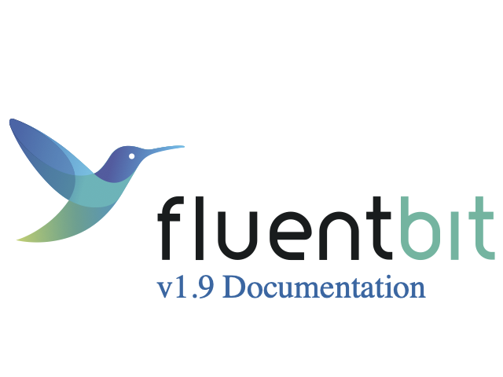

# Fluent Bit v1.9 Documentation

[Fluent Bit](http://fluentbit.io) is a Fast and Lightweight Logs and Metrics Processor and Forwarder for Linux, OSX, Windows and BSD family operating systems. It has been made with a strong focus on performance to allow the collection of events from different sources without complexity.

## Features

* High Performance
* Data Parsing
  * Convert your unstructured messages using our parsers: [JSON](pipeline/parsers/json.md), [Regex](pipeline/parsers/regular-expression.md), [LTSV](pipeline/parsers/ltsv.md) and [Logfmt](pipeline/parsers/logfmt.md)
* Metrics Collection \(Prometheus compatible\)
* Reliability and Data Integrity
  * [Backpressure](administration/backpressure.md) Handling
  * [Data Buffering](administration/buffering-and-storage.md) in memory and file system
* Networking
  * Security: built-in TLS/SSL support
  * Asynchronous I/O
* Pluggable Architecture and [Extensibility](development/library_api.md): Inputs, Filters and Outputs
  * More than 80 built-in plugins available
  * Extensibility
    * Write any input, filter or output plugin in C language
    * Bonus: write [Filters in Lua](pipeline/filters/lua.md) or [Output plugins in Golang](development/golang-output-plugins.md)
* [Monitoring](administration/monitoring.md): expose internal metrics over HTTP in JSON and [Prometheus](https://prometheus.io/) format
* [Stream Processing](https://github.com/fluent/fluent-bit-docs/tree/cfd3e4baa1d76a0778f5fd62bdf8de1e48360b72/stream-processing/README.md): Perform data selection and transformation using simple SQL queries
  * Create new streams of data using query results
  * Aggregation Windows
  * Data analysis and prediction: Timeseries forecasting
* Portable: runs on Linux, MacOS, Windows and BSD systems

## Fluent Bit, Fluentd and CNCF

[Fluent Bit](http://fluentbit.io) is a [CNCF](https://cncf.io) sub-project under the umbrella of [Fluentd](http://fluentd.org), it's licensed under the terms of the [Apache License v2.0](http://www.apache.org/licenses/LICENSE-2.0). This project was originally created by [Treasure Data](https://www.treasuredata.com) and is currently a **vendor neutral** and community driven project.

