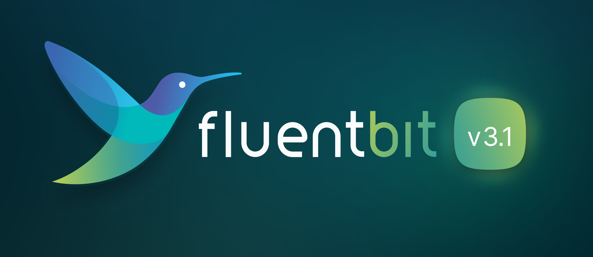

# Fluent Bit v3.1 Documentation

<figure><figcaption></figcaption></figure>

[Fluent Bit](http://fluentbit.io) is a fast and lightweight **telemetry agent**
for logs, metrics, and traces for Linux, macOS, Windows, and BSD family
operating systems. It has been made with a strong focus on performance to allow
the collection and processing of telemetry data from different sources without
complexity.

## Features

* High Performance: High throughput with low resources consumption
* Data Parsing
  * Convert your unstructured messages using our parsers: [JSON](pipeline/parsers/json.md), [Regex](pipeline/parsers/regular-expression.md), [LTSV](pipeline/parsers/ltsv.md) and [Logfmt](pipeline/parsers/logfmt.md)
* Metrics Support: Prometheus and OpenTelemetry compatible
* Reliability and Data Integrity
  * [Backpressure](administration/backpressure.md) Handling
  * [Data Buffering](administration/buffering-and-storage.md) in memory and file system
* Networking
  * Security: built-in TLS/SSL support
  * Asynchronous I/O
* Pluggable Architecture and [Extensibility](development/library_api.md): Inputs, Filters and Outputs
  * Connect nearly any source to nearly any destination using preexisting plugins
  * Extensibility
    * Write any input, filter or output plugin in C language
    * WASM: [WASM Filter Plugins](development/wasm-filter-plugins.md) or [WASM Input Plugins](development/wasm-input-plugins.md)
    * Bonus: write [Filters in Lua](pipeline/filters/lua.md) or [Output plugins in Golang](development/golang-output-plugins.md)
* [Monitoring](administration/monitoring.md): expose internal metrics over HTTP in JSON and [Prometheus](https://prometheus.io/) format
* [Stream Processing](stream-processing/introduction.md): Perform data selection and transformation using simple SQL queries
  * Create new streams of data using query results
  * Aggregation Windows
  * Data analysis and prediction: Timeseries forecasting
* Portable: runs on Linux, macOS, Windows and BSD systems

## Fluent Bit, Fluentd and CNCF

[Fluent Bit](http://fluentbit.io) is a [CNCF](https://cncf.io) **graduated** sub-project under the umbrella of [Fluentd](http://fluentd.org). Fluent Bit is licensed under the terms of the [Apache License v2.0](http://www.apache.org/licenses/LICENSE-2.0).

Fluent Bit was originally created by [Eduardo Silva](https://www.linkedin.com/in/edsiper/)
and is now sponsored by [Chronosphere](https://chronosphere.io/). As a
CNCF-hosted project, it is a fully **vendor-neutral** and community-driven
project.
