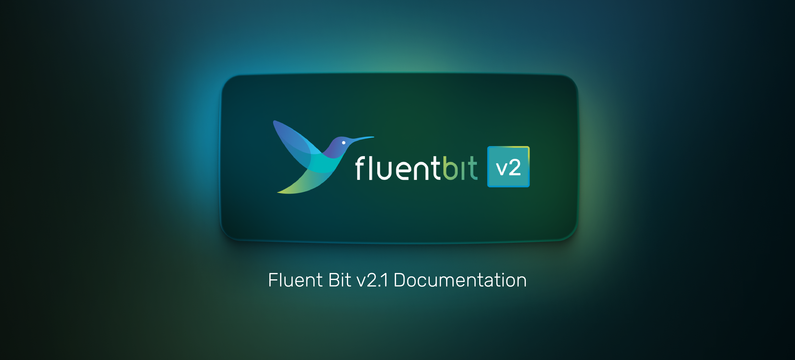

# Fluent Bit v2.1 Documentation

<figure><figcaption></figcaption></figure>

[Fluent Bit](http://fluentbit.io) is a Fast and Lightweight **Telemetry Agent** for Logs, Metrics, and Traces for Linux, macOS, Windows, and BSD family operating systems. It has been made with a strong focus on performance to allow the collection and processing of telemetry data from different sources without complexity.

## Features

* High Performance: High throughput with low resources consumption
* Data Parsing
  * Convert your unstructured messages using our parsers: [JSON](broken-reference/), [Regex](broken-reference/), [LTSV](broken-reference/) and [Logfmt](broken-reference/)
* Metrics Support: Prometheus and OpenTelemetry compatible
* Reliability and Data Integrity
  * [Backpressure](broken-reference/) Handling
  * [Data Buffering](broken-reference/) in memory and file system
* Networking
  * Security: built-in TLS/SSL support
  * Asynchronous I/O
* Pluggable Architecture and [Extensibility](broken-reference/): Inputs, Filters and Outputs
  * More than 100 built-in plugins are available
  * Extensibility
    * Write any input, filter or output plugin in C language
    * WASM: [WASM Filter Plugins](broken-reference/) or [WASM Input Plugins](broken-reference/)
    * Bonus: write [Filters in Lua](broken-reference/) or [Output plugins in Golang](broken-reference/)
* [Monitoring](broken-reference/): expose internal metrics over HTTP in JSON and [Prometheus](https://prometheus.io/) format
* [Stream Processing](broken-reference/): Perform data selection and transformation using simple SQL queries
  * Create new streams of data using query results
  * Aggregation Windows
  * Data analysis and prediction: Timeseries forecasting
* Portable: runs on Linux, macOS, Windows and BSD systems

## Fluent Bit, Fluentd and CNCF

[Fluent Bit](http://fluentbit.io) is a [CNCF](https://cncf.io) **graduated** sub-project under the umbrella of [Fluentd](http://fluentd.org), it's licensed under the terms of the [Apache License v2.0](http://www.apache.org/licenses/LICENSE-2.0).

Fluent Bit was originally created by [Eduardo Silva](https://www.linkedin.com/in/edsiper/); as a CNCF-hosted project is a fully **vendor-neutral** and community-driven project.
