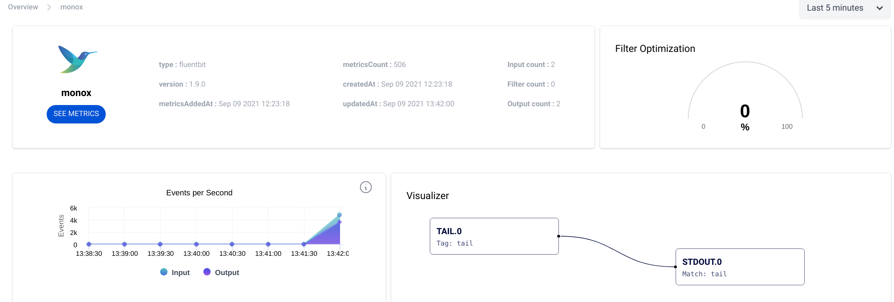

# Monitoring

Fluent Bit comes with built-it features to allow you to monitor the internals of your pipeline, connect to Prometheus and Grafana, Health checks  and also connectors to use external services for such purposes:

* [HTTP Server: JSON and Prometheus Exporter-style metrics](monitoring.md#http-server)
* [Grafana Dashboards and Alerts](monitoring.md#grafana-dashboard-and-alerts)
* [Health Checks](monitoring.md#health-check-for-fluent-bit)
* [Calyptia Cloud: hosted service to monitor and visualize your pipelines](monitoring.md#calyptia-cloud)


## HTTP Server

Fluent Bit comes with a built-in HTTP Server that can be used to query internal information and monitor metrics of each running plugin.

The monitoring interface can be easily integrated with Prometheus since we support it native format.

### Getting Started

To get started, the first step is to enable the HTTP Server from the configuration file:

```
[SERVICE]
    HTTP_Server  On
    HTTP_Listen  0.0.0.0
    HTTP_PORT    2020

[INPUT]
    Name cpu

[OUTPUT]
    Name  stdout
    Match *
```

the above configuration snippet will instruct Fluent Bit to start it HTTP Server on TCP Port 2020 and listening on all network interfaces:

```
$ bin/fluent-bit -c fluent-bit.conf
Fluent Bit v1.4.0
* Copyright (C) 2019-2020 The Fluent Bit Authors
* Copyright (C) 2015-2018 Treasure Data
* Fluent Bit is a CNCF sub-project under the umbrella of Fluentd
* https://fluentbit.io

[2020/03/10 19:08:24] [ info] [engine] started
[2020/03/10 19:08:24] [ info] [http_server] listen iface=0.0.0.0 tcp_port=2020
```

now with a simple **curl** command is enough to gather some information:

```
$ curl -s http://127.0.0.1:2020 | jq
{
  "fluent-bit": {
    "version": "0.13.0",
    "edition": "Community",
    "flags": [
      "FLB_HAVE_TLS",
      "FLB_HAVE_METRICS",
      "FLB_HAVE_SQLDB",
      "FLB_HAVE_TRACE",
      "FLB_HAVE_HTTP_SERVER",
      "FLB_HAVE_FLUSH_LIBCO",
      "FLB_HAVE_SYSTEMD",
      "FLB_HAVE_VALGRIND",
      "FLB_HAVE_FORK",
      "FLB_HAVE_PROXY_GO",
      "FLB_HAVE_REGEX",
      "FLB_HAVE_C_TLS",
      "FLB_HAVE_SETJMP",
      "FLB_HAVE_ACCEPT4",
      "FLB_HAVE_INOTIFY"
    ]
  }
}
```

Note that we are sending the _curl_ command output to the _jq_ program which helps to make the JSON data easy to read from the terminal. Fluent Bit don't aim to do JSON pretty-printing.

### REST API Interface

Fluent Bit aims to expose useful interfaces for monitoring, as of Fluent Bit v0.14 the following end points are available:

| URI                        | Description                                                                                                                                                        | Data Format           |
| -------------------------- | ------------------------------------------------------------------------------------------------------------------------------------------------------------------ | --------------------- |
| /                          | Fluent Bit build information                                                                                                                                       | JSON                  |
| /api/v1/uptime             | Get uptime information in seconds and human readable format                                                                                                        | JSON                  |
| /api/v1/metrics            | Internal metrics per loaded plugin                                                                                                                                 | JSON                  |
| /api/v1/metrics/prometheus | Internal metrics per loaded plugin ready to be consumed by a Prometheus Server                                                                                     | Prometheus Text 0.0.4 |
| /api/v1/storage            | Get internal metrics of the storage layer / buffered data. This option is enabled only if in the `SERVICE` section the property `storage.metrics` has been enabled | JSON                  |
| /api/v1/health             | Fluent Bit health check result                                                                                                                                     | String                |

### Metric Descriptions

The following are detailed descriptions for the metrics outputted in prometheus format by `/api/v1/metrics/prometheus`.

The following definitions are key to understand:
* record: a single message collected from a source, such as a single long line in a file. 
* chunk: Fluent Bit input plugin instances ingest log records and store them in chunks.  A batch of records in a chunk are tracked together as a single unit; the Fluent Bit engine attempts to fit records into chunks of at most 2 MB, but the size can vary at runtime. Chunks are then sent to an output. An output plugin instance can either successfully send the full chunk to the destination and mark it as successful, or it can fail the chunk entirely if an unrecoverable error is encountered, or it can ask for the chunk to be retried.

| Metric Name                            | Labels                                          | Description                                                                                                                                                                                                                                                                                  | Type    | Unit    |
|----------------------------------------|-------------------------------------------------|----------------------------------------------------------------------------------------------------------------------------------------------------------------------------------------------------------------------------------------------------------------------------------------------|---------|---------|
| fluentbit_input_bytes_total            | name: the name or alias for the input instance  | The number of bytes of log records that this input instance has successfully ingested                                                                                                                                                                                                        | counter | bytes   |
| fluentbit_input_records_total          | name: the name or alias for the input instance  | The number of log records this input has successfully ingested                                                                                                                                                                                                                               | counter | records |
| fluentbit_output_dropped_records_total | name: the name or alias for the output instance  | The number of log records that have been dropped by the output. This means they met an unrecoverable error or retries expired for their chunk.                                                                                                                                               | counter | records |
| fluentbit_output_errors_total          | name: the name or alias for the output instance  | The number of chunks that have faced an error (either unrecoverable or retriable). This is the number of times a chunk has failed, and does not correspond with the number of error messages you see in the Fluent Bit log output.                                                           | counter | chunks  |
| fluentbit_output_proc_bytes_total      | name: the name or alias for the output instance  | The number of bytes of log records that this output instance has *successfully* sent. This is the total byte size of all unique chunks sent by this output. If a record is not sent due to some error, then it will not count towards this metric.                                                                                                                                    | counter | bytes   |
| fluentbit_output_proc_records_total    |  name: the name or alias for the output instance | The number of log records that this output instance has *successfully* sent. This is the total record count of all unique chunks sent by this output. If a record is not successfully sent, it does not count towards this metric.                                                                                                                                          | counter | records |
| fluentbit_output_retried_records_total | name: the name or alias for the output instance  | The number of log records that experienced a retry. Note that this is calculated at the chunk level, the count increased when an entire chunk is marked for retry. An output plugin may or may not perform multiple actions that generate many error messages when uploading a single chunk. | counter | records |
| fluentbit_output_retries_failed_total  | name: the name or alias for the output instance  | The number of times that retries expired for a chunk. Each plugin configures a Retry_Limit which applies to chunks. Once the Retry_Limit has been reached for a chunk it is discarded and this metric is incremented.                                                                        | counter | chunks  |
| fluentbit_output_retries_total         | name: the name or alias for the output instance  | The number of times this output instance requested a retry for a chunk.                                                                                                                                                                                                                      | counter | chunks  |
| fluentbit_uptime                       |                                                 | The number of seconds that Fluent Bit has been running.                                                                                                                                                                                                                                     | counter | seconds |
| process_start_time_seconds             |                                                 | The Unix Epoch time stamp for when Fluent Bit started..                                                                                                                                                                                                                                      | guage   | seconds |


The following are detailed descriptions for the metrics outputted in JSON format by `/api/v1/storage`.


| Metric Key                                  | Description                                                                                                                                                              | Unit    |
|---------------------------------------------|--------------------------------------------------------------------------------------------------------------------------------------------------------------------------|---------|
| chunks.total_chunks                         | The total number of chunks of records that Fluent Bit is currently buffering                                                                                             | chunks  |
| chunks.mem_chunks                           | The total number of chunks that are buffered in memory at this time. Note that chunks can be both in memory and on the file system at the same time.                     | chunks  |
| chunks.fs_chunks                            | The total number of chunks saved to the filesystem.                                                                                                                      | chunks  |
| chunks.fs_chunks_up                         | A chunk is "up" if it is in memory. So this is the count of chunks that are both in filesystem and in memory.                                                            | chunks  |
| chunks.fs_chunks_down                       | The count of chunks that are "down" and thus are only in the filesystem.                                                                                                 | chunks  |
|                                             |                                                                                                                                                                          |         |
| input_chunks.{plugin name}.status.overlimit | Is this input instance over its configured Mem_Buf_Limit?                                                                                                                | boolean |
| input_chunks.{plugin name}.status.mem_size  | The size of memory that this input is consuming to buffer logs in chunks.                                                                                                | bytes   |
| input_chunks.{plugin name}.status.mem_limit | The buffer memory limit (Mem_Buf_Limit) that applies to this input plugin.                                                                                               | bytes   |
|                                             |                                                                                                                                                                          |         |
| input_chunks.{plugin name}.chunks.total     | The current total number of chunks owned by this input instance.                                                                                                         | chunks  |
| input_chunks.{plugin name}.chunks.up        | The current number of chunks that are "up" in memory for this input. Chunks that are "up" will also be in the filesystem layer as well if filesystem storage is enabled. | chunks  |
| input_chunks.{plugin name}.chunks.down      | The current number of chunks that are "down" in the filesystem for this input.                                                                                           | chunks  |
| input_chunks.{plugin name}.chunks.busy      | "Busy" chunks are chunks that are being processed/sent by outputs and are not eligible to have new data appended.                                                        | chunks  |
| input_chunks.{plugin name}.chunks.busy_size | The sum of the byte size of each chunk which is currently marked as busy.                                                                                                | bytes   |


### Uptime Example

Query the service uptime with the following command:

```
$ curl -s http://127.0.0.1:2020/api/v1/uptime | jq
```

it should print a similar output like this:

```javascript
{
  "uptime_sec": 8950000,
  "uptime_hr": "Fluent Bit has been running:  103 days, 14 hours, 6 minutes and 40 seconds"
}
```

### Metrics Examples

Query internal metrics in JSON format with the following command:

```bash
$ curl -s http://127.0.0.1:2020/api/v1/metrics | jq
```

it should print a similar output like this:

```javascript
{
  "input": {
    "cpu.0": {
      "records": 8,
      "bytes": 2536
    }
  },
  "output": {
    "stdout.0": {
      "proc_records": 5,
      "proc_bytes": 1585,
      "errors": 0,
      "retries": 0,
      "retries_failed": 0
    }
  }
}
```

### Metrics in Prometheus format

Query internal metrics in Prometheus Text 0.0.4 format:

```bash
$ curl -s http://127.0.0.1:2020/api/v1/metrics/prometheus
```

this time the same metrics will be in Prometheus format instead of JSON:

```
fluentbit_input_records_total{name="cpu.0"} 57 1509150350542
fluentbit_input_bytes_total{name="cpu.0"} 18069 1509150350542
fluentbit_output_proc_records_total{name="stdout.0"} 54 1509150350542
fluentbit_output_proc_bytes_total{name="stdout.0"} 17118 1509150350542
fluentbit_output_errors_total{name="stdout.0"} 0 1509150350542
fluentbit_output_retries_total{name="stdout.0"} 0 1509150350542
fluentbit_output_retries_failed_total{name="stdout.0"} 0 1509150350542
```

### Configuring Aliases

By default configured plugins on runtime get an internal name in the format _plugin_name.ID_. For monitoring purposes, this can be confusing if many plugins of the same type were configured. To make a distinction each configured input or output section can get an _alias_ that will be used as the parent name for the metric.

The following example set an alias to the INPUT section which is using the [CPU](../pipeline/inputs/cpu-metrics.md) input plugin:

```
[SERVICE]
    HTTP_Server  On
    HTTP_Listen  0.0.0.0
    HTTP_PORT    2020

[INPUT]
    Name  cpu
    Alias server1_cpu

[OUTPUT]
    Name  stdout
    Alias raw_output
    Match *
```

Now when querying the metrics we get the aliases in place instead of the plugin name:

```javascript
{
  "input": {
    "server1_cpu": {
      "records": 8,
      "bytes": 2536
    }
  },
  "output": {
    "raw_output": {
      "proc_records": 5,
      "proc_bytes": 1585,
      "errors": 0,
      "retries": 0,
      "retries_failed": 0
    }
  }
}
```

## Grafana Dashboard and Alerts

Fluent Bit's exposed [prometheus style metrics](https://docs.fluentbit.io/manual/administration/monitoring) can be leveraged to create dashboards and alerts.

The provided [example dashboard](https://github.com/fluent/fluent-bit-docs/tree/8172a24d278539a1420036a9434e9f56d987a040/monitoring/dashboard.json) is heavily inspired by [Banzai Cloud](https://banzaicloud.com)'s [logging operator dashboard](https://grafana.com/grafana/dashboards/7752) but with a few key differences such as the use of the `instance` label (see [why here](https://www.robustperception.io/controlling-the-instance-label)), stacked graphs and a focus on Fluent Bit metrics.


### Alerts

Sample alerts are available [here](https://github.com/fluent/fluent-bit-docs/tree/8172a24d278539a1420036a9434e9f56d987a040/monitoring/alerts.yaml).

## Health Check for Fluent Bit

Fluent bit now supports four new configs to set up the health check.

| Config Name            | Description                                                                                                                                                                                                                                                                                                                             | Default Value |
| ---------------------- | ----------------------------------------------------------------------------------------------------------------------------------------------------------------------------------------------------------------------------------------------------------------------------------------------------------------------------------------| ------------- |
| Health_Check           | enable Health check feature                                                                                                                                                                                                                                                                                                             | Off           |
| HC_Errors_Count        | the error count to meet the unhealthy requirement, this is a sum for all output plugins in a defined HC_Period, example for output error: ` [2022/02/16 10:44:10] [ warn] [engine] failed to flush chunk '1-1645008245.491540684.flb', retry in 7 seconds: task_id=0, input=forward.1 > output=cloudwatch_logs.3 (out_id=3)`            | 5             |
| HC_Retry_Failure_Count | the retry failure count to meet the unhealthy requirement, this is a sum for all output plugins in a defined HC_Period, example for retry failure: `[2022/02/16 20:11:36] [ warn] [engine] chunk '1-1645042288.260516436.flb' cannot be retried: task_id=0, input=tcp.3 > output=cloudwatch_logs.1 `                                    | 5             |
| HC_Period              | The time period by second to count the error and retry failure data point                                                                                                                                                                                                                                                               | 60            |

*Note: Not every error log means an error nor be counted, the errors retry failures count only on specific errors which is the example in config table description*

So the feature works as: Based on the HC_Period customer setup, if the real error number is over `HC_Errors_Count` or retry failure is over `HC_Retry_Failure_Count`, fluent bit will be considered as unhealthy. The health endpoint will return HTTP status 500 and String `error`. Otherwise it's healthy, will return HTTP status 200 and string `ok`

The equation is: 
```
health status = (HC_Errors_Count > HC_Errors_Count config value) OR (HC_Retry_Failure_Count > HC_Retry_Failure_Count config value) IN the HC_Period interval
```
*Note: the HC_Errors_Count and HC_Retry_Failure_Count only count for output plugins and count a sum for errors and retry failures from all output plugins which is running.*

See the config example:

```
[SERVICE]
    HTTP_Server  On
    HTTP_Listen  0.0.0.0
    HTTP_PORT    2020
    Health_Check On 
    HC_Errors_Count 5 
    HC_Retry_Failure_Count 5 
    HC_Period 5 

[INPUT]
    Name  cpu

[OUTPUT]
    Name  stdout
    Match *
```

The command to call health endpoint

```bash
$ curl -s http://127.0.0.1:2020/api/v1/health
```

Based on the fluent bit status, the result will be:

* HTTP status 200 and "ok" in response to healthy status
* HTTP status 500 and "error" in response for unhealthy status

With the example config, the health status is determined by following equation:
```
Health status = (HC_Errors_Count > 5) OR (HC_Retry_Failure_Count > 5) IN 5 seconds
```
If (HC_Errors_Count > 5) OR (HC_Retry_Failure_Count > 5) IN 5 seconds is TRUE, then it's unhealthy.

If (HC_Errors_Count > 5) OR (HC_Retry_Failure_Count > 5) IN 5 seconds is FALSE, then it's healthy.


## Calyptia Cloud

[Calyptia Cloud](https://cloud.calyptia.com) is a hosted service that allows you to monitor your Fluent Bit agents including data flow, metrics and configurations.


### Get Started with Calyptia Cloud

Register your Fluent Bit agent will take **less than one minute**, steps:

* Go to [cloud.calyptia.com](https://cloud.calyptia.com) and sign-in
* On the left menu click on [Settings](https://cloud.calyptia.com/settings) and generate/copy your API key

In your Fluent Bit configuration file, append the following configuration section:

```
[CUSTOM]
    name     calyptia
    api_key  <YOUR_API_KEY>
```

Make sure to replace your API key in the configuration.\
\
After a few seconds upon restart your Fluent Bit agent, the Calyptia Cloud Dashboard will list your agent. Metrics will take around 30 seconds to shows up.



###  Contact Calyptia

If  want to get in touch with Calyptia team, just send an email to [hello@calyptia.com](mailto:hello@calyptia.com)
