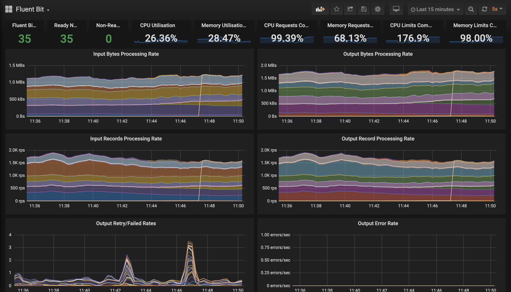

# Monitoring

Fluent Bit comes with a built-in HTTP Server that can be used to query internal information and monitor metrics of each running plugin.

The monitoring interface can be easily integrated with Prometheus since we support it native format.

**NOTE:** The Windows version does not support the HTTP monitoring feature yet as of v1.7.0

## Getting Started <a id="getting_started"></a>

To get started, the first step is to enable the HTTP Server from the configuration file:

```text
[SERVICE]
    HTTP_Server  On
    HTTP_Listen  0.0.0.0
    HTTP_PORT    2020

[INPUT]
    Name cpu

[OUTPUT]
    Name  stdout
    Match *
```

the above configuration snippet will instruct Fluent Bit to start it HTTP Server on TCP Port 2020 and listening on all network interfaces:

```text
$ bin/fluent-bit -c fluent-bit.conf
Fluent Bit v1.4.0
* Copyright (C) 2019-2020 The Fluent Bit Authors
* Copyright (C) 2015-2018 Treasure Data
* Fluent Bit is a CNCF sub-project under the umbrella of Fluentd
* https://fluentbit.io

[2020/03/10 19:08:24] [ info] [engine] started
[2020/03/10 19:08:24] [ info] [http_server] listen iface=0.0.0.0 tcp_port=2020
```

now with a simple **curl** command is enough to gather some information:

```text
$ curl -s http://127.0.0.1:2020 | jq
{
  "fluent-bit": {
    "version": "0.13.0",
    "edition": "Community",
    "flags": [
      "FLB_HAVE_TLS",
      "FLB_HAVE_METRICS",
      "FLB_HAVE_SQLDB",
      "FLB_HAVE_TRACE",
      "FLB_HAVE_HTTP_SERVER",
      "FLB_HAVE_FLUSH_LIBCO",
      "FLB_HAVE_SYSTEMD",
      "FLB_HAVE_VALGRIND",
      "FLB_HAVE_FORK",
      "FLB_HAVE_PROXY_GO",
      "FLB_HAVE_REGEX",
      "FLB_HAVE_C_TLS",
      "FLB_HAVE_SETJMP",
      "FLB_HAVE_ACCEPT4",
      "FLB_HAVE_INOTIFY"
    ]
  }
}
```

Note that we are sending the _curl_ command output to the _jq_ program which helps to make the JSON data easy to read from the terminal. Fluent Bit don't aim to do JSON pretty-printing.

## REST API Interface <a id="rest_api"></a>

Fluent Bit aims to expose useful interfaces for monitoring, as of Fluent Bit v0.14 the following end points are available:

| URI | Description | Data Format |
| :--- | :--- | :--- |
| / | Fluent Bit build information | JSON |
| /api/v1/uptime | Get uptime information in seconds and human readable format | JSON |
| /api/v1/metrics | Internal metrics per loaded plugin | JSON |
| /api/v1/metrics/prometheus | Internal metrics per loaded plugin ready to be consumed by a Prometheus Server | Prometheus Text 0.0.4 |
| /api/v1/storage | Get internal metrics of the storage layer / buffered data. This option is enabled only if in the `SERVICE` section the property `storage.metrics` has been enabled | JSON |

## Uptime Example

Query the service uptime with the following command:

```text
$ curl -s http://127.0.0.1:2020/api/v1/uptime | jq
```

it should print a similar output like this:

```javascript
{
  "uptime_sec": 8950000,
  "uptime_hr": "Fluent Bit has been running:  103 days, 14 hours, 6 minutes and 40 seconds"
}
```

## Metrics Examples

Query internal metrics in JSON format with the following command:

```bash
$ curl -s http://127.0.0.1:2020/api/v1/metrics | jq
```

it should print a similar output like this:

```javascript
{
  "input": {
    "cpu.0": {
      "records": 8,
      "bytes": 2536
    }
  },
  "output": {
    "stdout.0": {
      "proc_records": 5,
      "proc_bytes": 1585,
      "errors": 0,
      "retries": 0,
      "retries_failed": 0
    }
  }
}
```

### Metrics in Prometheus format

Query internal metrics in Prometheus Text 0.0.4 format:

```bash
$ curl -s http://127.0.0.1:2020/api/v1/metrics/prometheus
```

this time the same metrics will be in Prometheus format instead of JSON:

```text
fluentbit_input_records_total{name="cpu.0"} 57 1509150350542
fluentbit_input_bytes_total{name="cpu.0"} 18069 1509150350542
fluentbit_output_proc_records_total{name="stdout.0"} 54 1509150350542
fluentbit_output_proc_bytes_total{name="stdout.0"} 17118 1509150350542
fluentbit_output_errors_total{name="stdout.0"} 0 1509150350542
fluentbit_output_retries_total{name="stdout.0"} 0 1509150350542
fluentbit_output_retries_failed_total{name="stdout.0"} 0 1509150350542
```

## Configuring Aliases

By default configured plugins on runtime get an internal name in the format _plugin\_name.ID_. For monitoring purposes this can be confusing if many plugins of the same type were configured. To make a distinction each configured input or output section can get an _alias_ that will be used as the parent name for the metric.

The following example set an alias to the INPUT section which is using the [CPU](../pipeline/inputs/cpu-metrics.md) input plugin:

```text
[SERVICE]
    HTTP_Server  On
    HTTP_Listen  0.0.0.0
    HTTP_PORT    2020

[INPUT]
    Name  cpu
    Alias server1_cpu

[OUTPUT]
    Name  stdout
    Alias raw_output
    Match *
```

Now when querying the metrics we get the aliases in place instead of the plugin name:

```javascript
{
  "input": {
    "server1_cpu": {
      "records": 8,
      "bytes": 2536
    }
  },
  "output": {
    "raw_output": {
      "proc_records": 5,
      "proc_bytes": 1585,
      "errors": 0,
      "retries": 0,
      "retries_failed": 0
    }
  }
}
```

## Dashboard and Alerts

Fluent Bit's exposed [prometheus style metrics](https://docs.fluentbit.io/manual/administration/monitoring) can be leveraged to create dashboards and alerts.

### Grafana Dashboard

The provided [example dashboard](https://github.com/fluent/fluent-bit-docs/tree/8172a24d278539a1420036a9434e9f56d987a040/monitoring/dashboard.json) is heavily inspired by [Banzai Cloud](https://banzaicloud.com/)'s [logging operator dashboard](https://grafana.com/grafana/dashboards/7752) but with a few key differences such as the use of the `instance` label \(see [why here](https://www.robustperception.io/controlling-the-instance-label)\), stacked graphs and a focus on Fluent Bit metrics.



### Alerts

Sample alerts are available [here](https://github.com/fluent/fluent-bit-docs/tree/8172a24d278539a1420036a9434e9f56d987a040/monitoring/alerts.yaml).

