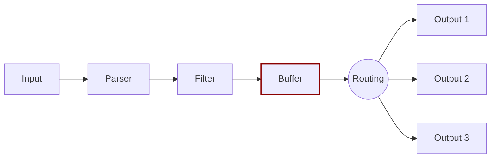

# Buffering

When [Fluent Bit](https://fluentbit.io) processes data, it uses the system memory (heap) as a primary and temporary place to store the record logs before they get delivered. The records are processed in this private memory area.

Buffering is the ability to store the records, and continue storing incoming data while previous data is processed and delivered. Buffering in memory is the fastest mechanism, but there are scenarios requiring special strategies to deal with [backpressure](../administration/backpressure.md), data safety, or to reduce memory consumption by the service in constrained environments.

Network failures or latency in third party service is common. When data can't be delivered fast enough and new data to process arrives, the system can face backpressure.

Fluent Bit buffering strategies are designed to solve problems associated with backpressure and general delivery failures. Fluent Bit offers a primary buffering mechanism in memory and an optional secondary one using the file system. With this hybrid solution you can accommodate any use case safely and keep a high performance while processing your data.

These mechanisms aren't mutually exclusive. When data is ready to be processed or delivered it's always be in memory. Other data in the queue might be in the file system until is ready to be processed and moved up to memory.

The `buffer` phase contains the data in an immutable state, meaning that no other filter can be applied.

Buffered data uses the Fluent Bit internal binary representation, which isn't raw text.

Fluent Bit offers a buffering mechanism in the file system that acts as a backup system to avoid data loss in case of system failures.

To learn more about the buffering configuration in Fluent Bit, see [Buffering and Storage](../administration/buffering-and-storage.md).
