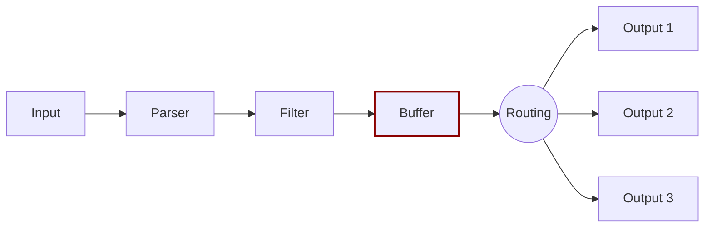

# Buffer

Previously defined in the [Buffering](../buffering.md) concept section, the `buffer` phase in the pipeline aims to provide a unified and persistent mechanism to store your data, either using the primary in-memory model or using the filesystem based mode.

The `buffer` phase already contains the data in an immutable state, meaning that no other filter can be applied.


Note that buffered data is not raw text, it's in Fluent Bit's internal binary representation.


Fluent Bit offers a buffering mechanism in the file system that acts as a _backup system_ to avoid data loss in case of system failures.
