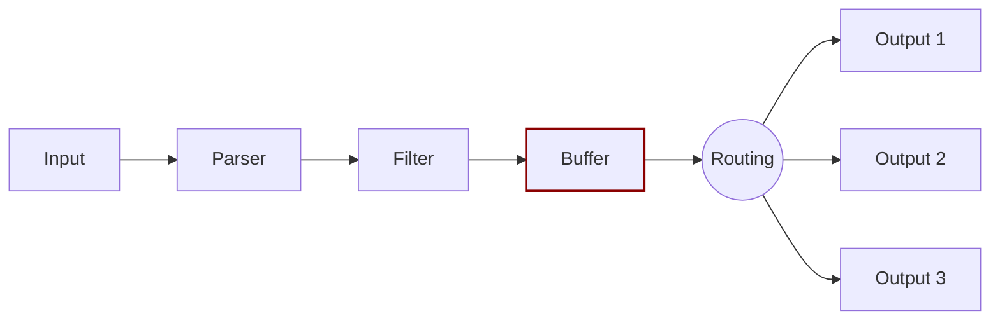

# Buffer

The [`buffer`](../buffering.md) phase in the pipeline aims to provide a unified and
persistent mechanism to store your data, using the primary in-memory model or the
file system-based mode.

The `buffer` phase contains the data in an immutable state, meaning that no other
filter can be applied.

Buffered data uses the Fluent Bit internal binary representation, which isn't raw text.

Fluent Bit offers a buffering mechanism in the file system that acts as a backup
system to avoid data loss in case of system failures.
