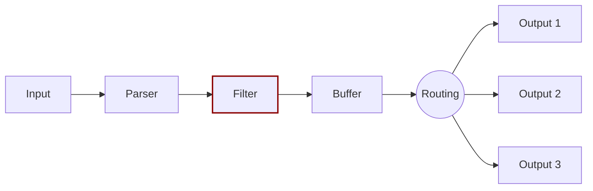

# Filter

In production environments you need full control of the data you're collecting.
Filtering lets you alter the collected data before delivering it to a destination.

Filtering is implemented through plugins. Each available filter can be used to
match, exclude, or enrich your logs with specific metadata.

Fluent Bit support many filters. A common use case for filtering is Kubernetes
deployments. Every pod log needs the proper metadata associated with it.

Like input plugins, filters run in an instance context, which has its own independent
configuration. Configuration keys are often called _properties_.

For more details about the Filters available and their usage, see
[Filters](https://docs.fluentbit.io/manual/pipeline/filters).
