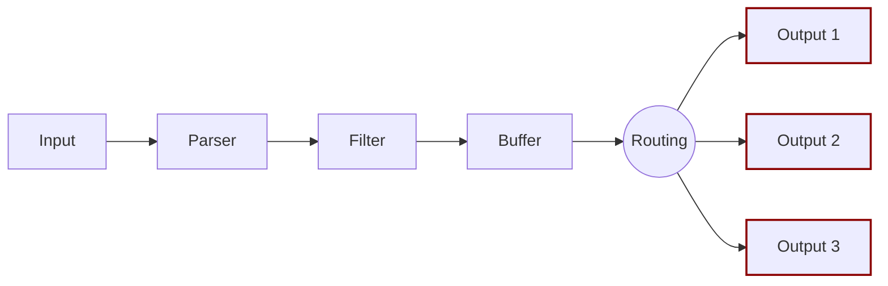

# Output

The output interface lets you define destinations for your data. Common destinations
are remote services, local file systems, or other standard interfaces. Outputs are
implemented as plugins.

When an output plugin is loaded, an internal _instance_ is created. Every instance
has its own independent configuration. Configuration keys are often called
_properties_.

Every output plugin has its own documentation section specifying how it can be used and what properties are available.

For more details, see [Output Plugins](https://docs.fluentbit.io/manual/pipeline/outputs).
