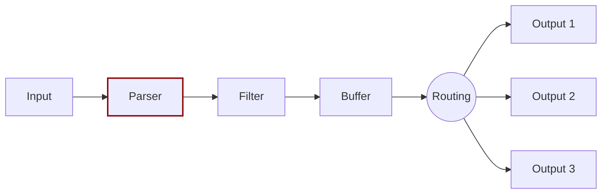

# Parser

Dealing with raw strings or unstructured messages is difficult. Having a structure makes data more usable. Set a structure to the incoming data by using input plugins as data is collected:



The parser converts unstructured data to structured data. As an example, consider the following Apache (HTTP Server) log entry:

```text
192.168.2.20 - - [28/Jul/2006:10:27:10 -0300] "GET /cgi-bin/try/ HTTP/1.0" 200 3395
```

This log line is a raw string without format. Structuring the log makes it easier to process the data later. If the [regular expression parser](../../pipeline/parsers/regular-expression.md) is used, the log entry could be converted to:

```javascript
{
  "host":    "192.168.2.20",
  "user":    "-",
  "method":  "GET",
  "path":    "/cgi-bin/try/",
  "code":    "200",
  "size":    "3395",
  "referer": "",
  "agent":   ""
 }
```

Parsers are fully configurable and are independently and optionally handled by each input plugin. For more details, see [Parsers](https://docs.fluentbit.io/manual/pipeline/parsers).
