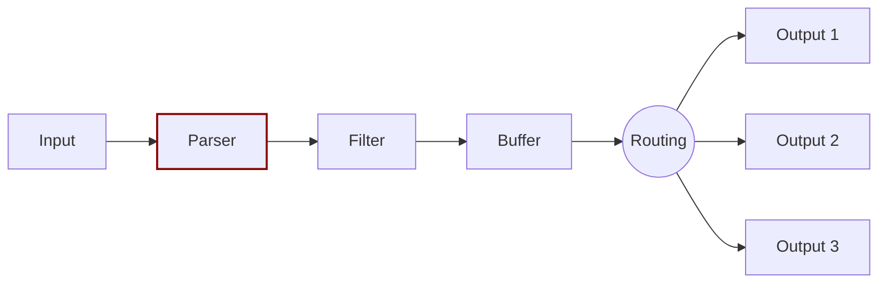

# Parser

Dealing with raw strings or unstructured messages is a constant pain; having a structure is highly desired. Ideally we want to set a structure to the incoming data by the Input Plugins as soon as they are collected:


The Parser allows you to convert from unstructured to structured data. As a demonstrative example consider the following Apache (HTTP Server) log entry:

```
192.168.2.20 - - [28/Jul/2006:10:27:10 -0300] "GET /cgi-bin/try/ HTTP/1.0" 200 3395
```

The above log line is a raw string without format, ideally we would like to give it a structure that can be processed later easily. If the proper configuration is used, the log entry could be converted to:

```javascript
{
  "host":    "192.168.2.20",
  "user":    "-",
  "method":  "GET",
  "path":    "/cgi-bin/try/",
  "code":    "200",
  "size":    "3395",
  "referer": "",
  "agent":   ""
 }
```

Parsers are fully configurable and are independently and optionally handled by each input plugin, for more details please refer to the [Parsers](https://docs.fluentbit.io/manual/pipeline/parsers) section.
