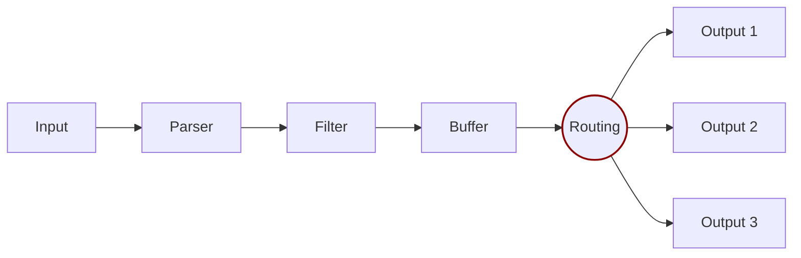

# Router

Routing is a core feature that allows to **route** your data through Filters and finally to one or multiple destinations. The router relies on the concept of [Tags](../key-concepts.md) and [Matching](../key-concepts.md) rules



There are two important concepts in Routing:

* Tag
* Match

When the data is generated by the input plugins, it comes with a **Tag** (most of the time the Tag is configured manually), the Tag is a human-readable indicator that helps to identify the data source.

In order to define **where** the data should be routed, a **Match** rule must be specified in the output configuration.

Consider the following configuration example that aims to deliver CPU metrics to an Elasticsearch database and Memory metrics to the standard output interface:

```
[INPUT]
    Name cpu
    Tag  my_cpu

[INPUT]
    Name mem
    Tag  my_mem

[OUTPUT]
    Name   es
    Match  my_cpu

[OUTPUT]
    Name   stdout
    Match  my_mem
```

> Note: the above is a simple example demonstrating how Routing is configured.

Routing works automatically reading the Input Tags and the Output Match rules. If some data has a Tag that doesn't match upon routing time, the data is deleted.

## Routing with Wildcard

Routing is flexible enough to support _wildcard_ in the **Match** pattern. The below example defines a common destination for both sources of data:

```
[INPUT]
    Name cpu
    Tag  my_cpu

[INPUT]
    Name mem
    Tag  my_mem

[OUTPUT]
    Name   stdout
    Match  my_*
```

The match rule is set to **my\_\*** which means it will match any Tag that starts with **my\_**.

## Routing with Regex

Routing also provides support for _regex_ with the **Match_Regex** pattern, allowing for more complex and precise matching criteria.
The following example demonstrates how to route data from sources based on a regular expression:

```
[INPUT]
    Name temperature_sensor
    Tag  temp_sensor_A

[INPUT]
    Name humidity_sensor
    Tag  humid_sensor_B

[OUTPUT]
    Name         stdout
    Match_regex  .*_sensor_[AB]
```

In this configuration, the **Match_regex** rule is set to `.*_sensor_[AB]`. This regular expression will match any Tag that ends with "_sensor_A" or "_sensor_B", regardless of what precedes it.
This approach provides a more flexible and powerful way to handle different source tags with a single routing rule.
