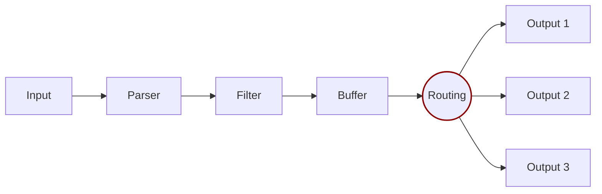

# Router

Routing is a core feature that lets you route your data through filters and then to one or multiple destinations. The router relies on the concept of [Tags](../key-concepts.md) and [Matching](../key-concepts.md) rules.



There are two important concepts in Routing:

- Tag
- Match

When data is generated by an input plugin, it comes with a `Tag`. A Tag is a human-readable indicator that helps to identify the data source. Tags are usually configured manually.

To define where to route data, specify a `Match` rule in the output configuration.

Consider the following configuration example that delivers `CPU` metrics to an Elasticsearch database and Memory (`mem`) metrics to the standard output interface:




```yaml
pipeline:
    inputs:
        - name: cpu
          tag: my_cpu

        - name: mem
          tag: my_mem

    outputs:
        - name: es
          match: my_cpu

        - name: stdout
          match: my_mem
```





```text
[INPUT]
    Name cpu
    Tag  my_cpu

[INPUT]
    Name mem
    Tag  my_mem

[OUTPUT]
    Name   es
    Match  my_cpu

[OUTPUT]
    Name   stdout
    Match  my_mem
```




Routing reads the `Input` `Tag` and the `Output` `Match` rules. If data has a `Tag` that doesn't match at routing time, the data is deleted.

## Routing with wildcards

Routing is flexible enough to support wildcards in the `Match` pattern. The following example defines a common destination for both sources of data:




```yaml
pipeline:
    inputs:
        - name: cpu
          tag: my_cpu

        - name: mem
          tag: my_mem

    outputs:
        - name: stdout
          match: 'my_*'
```





```text
[INPUT]
    Name cpu
    Tag  my_cpu

[INPUT]
    Name mem
    Tag  my_mem

[OUTPUT]
    Name   stdout
    Match  my_*
```




The match rule is set to `my_*`, which matches any Tag starting with `my_`.

## Routing with regular expressions

Routing also provides support for regular expressions with the `Match_Regex` pattern, allowing for more complex and precise matching criteria. The following example demonstrates how to route data from sources based on a regular expression:




```yaml
pipeline:
    inputs:
        - name: temperature_sensor
          tag: temp_sensor_A

        - name: humidity_sensor
          tag: humid_sensor_B

    outputs:
        - name: stdout
          match: '.*_sensor_[AB]'
```





```text
[INPUT]
    Name temperature_sensor
    Tag  temp_sensor_A

[INPUT]
    Name humidity_sensor
    Tag  humid_sensor_B

[OUTPUT]
    Name         stdout
    Match_regex  .*_sensor_[AB]
```




In this configuration, the `Match_regex` rule is set to `.*_sensor_[AB]`. This regular expression matches any `Tag` that ends with `_sensor_A` or `_sensor_B`, regardless of what precedes it. This approach provides a more flexible and powerful way to handle different source tags with a single routing rule.
