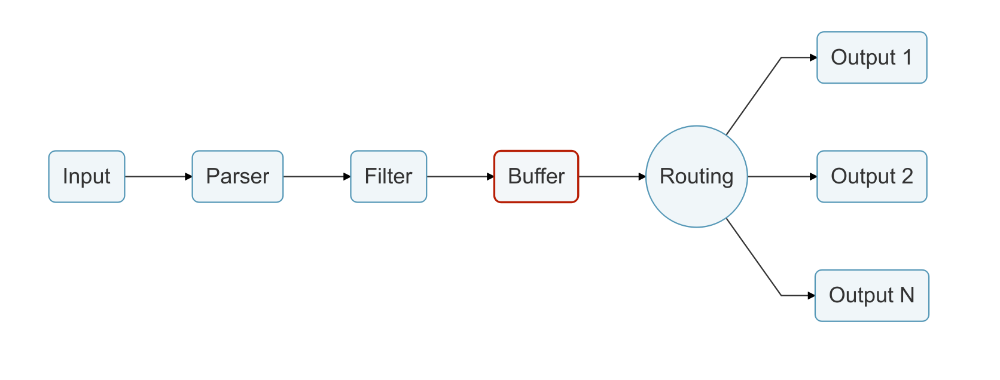

# Buffer

When the data or logs are ready to be routed to some destination, by default they are buffered in memory.

> Note that buffered data is not longer a raw text, instead it's in Fluent Bit internal binary representation.

Optionally Fluent Bit offers a buffering mechanism in the file system that acts as a _backup system_ to avoid data loss in case of system failures.

