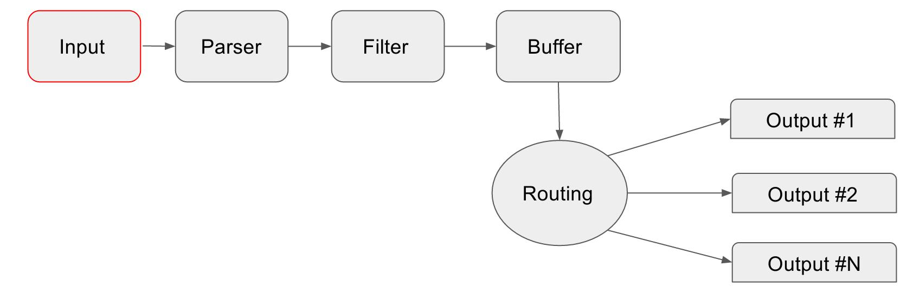

# Input

[Fluent Bit](http://fluentbit.io) provides different _Input Plugins_ to gather information from different sources, some of them just collect data from log files while others can gather metrics information from the operating system. There are many plugins for different needs.

When an input plugin is loaded, an internal _instance_ is created. Every instance have it own and independent configuration. Configuration keys are often called **properties**.

Every input plugin have it own documentation section where it specify how it can be used and the properties available.

For more details, please refer to the [Input Plugins](../input/) section.

