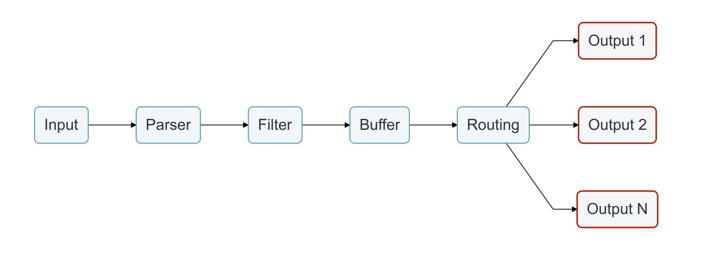

# Output

The output interface allows to define destinations for the data. Common destinations are remote services, local file system or standard interface within others. Otputs are implemented as plugins and there are many available.

When an output plugin is loaded, an internal _instance_ is created. Every instance have it own and independent configuration. Configuration keys are often called __properties__.

Every output plugin have it own documentation section where it specify how it can be used and the properties available.

For more details, please refer to the [Output Plugins](../output/README.md) section.
