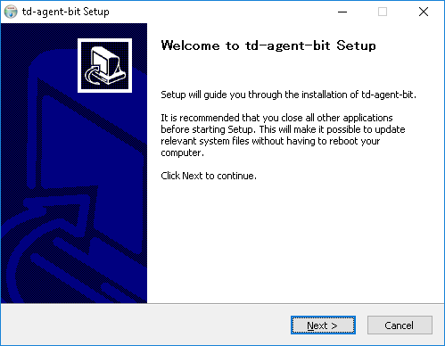

# Windows Packages

Fluent Bit is distributed as **td-agent-bit** package for Windows. Fluent Bit has two flavours of Windows installers: a ZIP archive (for quick testing) and an EXE installer (for system installation).

## Installation Packages

The latest stable version is 1.2.2.

| INSTALLERS                   | SHA256 CHECKSUMS                                                |
| ---------------------------- | ---------------------------------------------------------------- |
| td-agent-bit-1.2.2-win32.exe | b9e2695e6cc1b15e0e47d20624d6509cecbdd1767b6681751190f54e52832b6a |
| td-agent-bit-1.2.2-win32.zip | 4212e28fb6cb970ce9f27439f8dce3281ab544a4f7c9ae71991480a7e7a64afd |
| td-agent-bit-1.2.2-win64.exe | 6059e2f4892031125aac30325be4c167daed89742705fa883d34d91dc306645e |
| td-agent-bit-1.2.2-win64.zip | a6a02e7027f4409c1392e6df0c1463d5e979deab818f23959b4a00c741399e8e |

To check the integrity, use `Get-FileHash` commandlet on PowerShell.

```text
PS> Get-FileHash td-agent-bit-1.2.2-win32.exe
```

## Installing from ZIP archive

Download a ZIP archive [from the download page](https://fluentbit.io/). There are installers for 32-bit and 64-bit environments, so choose one suitable for your environment.

Then you need to expand the ZIP archive. You can do this by clicking "Extract All" on Explorer, or if you're using PowerShell, you can use `Expand-Archive` commandlet.

```text
PS> Expand-Archive td-agent-bit-1.2.0-win64.zip
```

The ZIP package contains the following set of files.

```text
td-agent-bit
├── bin
│   ├── fluent-bit.dll
│   └── fluent-bit.exe
├── conf
│   ├── fluent-bit.conf
│   ├── parsers.conf
│   └── plugins.conf
└── include
    │   ├── flb_api.h
    │   ├── ...
    │   └── flb_worker.h
    └── fluent-bit.h
```

Now, launch cmd.exe or PowerShell on your machine, and execute `fluent-bit.exe` as follows.

```text
PS> .\bin\fluent-bit.exe -i dummy -o stdout
```

If you see the following output, it's working fine!

```text
PS> .\bin\fluent-bit.exe  -i dummy -o stdout
Fluent Bit v1.2.0
Copyright (C) Treasure Data

[2019/06/28 10:13:04] [ info] [storage] initializing...
[2019/06/28 10:13:04] [ info] [storage] in-memory
[2019/06/28 10:13:04] [ info] [storage] normal synchronization mode, checksum disabled, max_chunks_up=128
[2019/06/28 10:13:04] [ info] [engine] started (pid=10324)
[2019/06/28 10:13:04] [ info] [sp] stream processor started
[0] dummy.0: [1561684385.443823800, {"message"=>"dummy"}]
[1] dummy.0: [1561684386.428399000, {"message"=>"dummy"}]
[2] dummy.0: [1561684387.443641900, {"message"=>"dummy"}]
[3] dummy.0: [1561684388.441405800, {"message"=>"dummy"}]
```

To halt the process, press CTRL-C in the terminal.

## Installing from EXE installer

Download an EXE installer from the [download page](https://fluentbit.io/download/). It has both 32-bit and 64-bit builds. Choose one which is suitable for you.

Then, double-click the EXE installer you've downloaded. Installation wizard will automatically start.



Click Next and proceed. By default, Fluent Bit is installed into `C:\Program Files\td-agent-bit\`, so you should be able to launch fluent-bit as follow after installation.

```text
PS> C:\Program Files\td-agent-bit\bin\fluent-bit.exe -i dummy -o stdout
```
