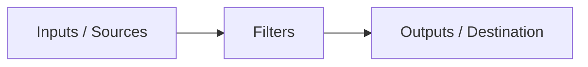
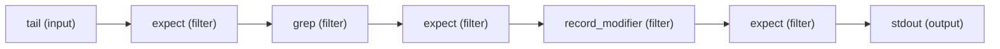

# Validate your data and structure

Fluent Bit supports multiple sources and formats. In addition, it provides filters that you can use to perform custom modifications. As your pipeline grows, it's important to validate your data and structure.

Fluent Bit users are encouraged to integrate data validation in their continuous integration (CI) systems.

In a normal production environment, inputs, filters, and outputs are defined in configuration files. Fluent Bit provides the [Expect](../pipeline/filters/expect.md) filter, which you can use to validate keys and values from your records and take action when an exception is found.

A simplified view of the data processing pipeline is as follows:



## Understand structure and configuration

Consider the following pipeline, which uses a JSON file as its data source and has two filters:

- [Grep](../pipeline/filters/grep.md) to exclude certain records.
- [Record Modifier](../pipeline/filters/record-modifier.md) to alter records' content by adding and removing specific keys.


Add data validation between each step to ensure your data structure is correct.

This example uses the [Expect](../pipeline/filters/expect) filter.



Expect filters set rules aiming to validate criteria like:

- Does the record contain key `A`?
- Does the record not contain key `A`?
- Does the key `A` value equal `NULL`?
- Is the key `A` value not `NULL`?
- Does the key `A` value equal `B`?

Every Expect filter configuration exposes rules to validate the content of your records using [configuration parameters](../pipeline/filters/expect.md#configuration-parameters).

## Test the configuration

Consider a JSON file `data.log` with the following content:

```javascript
{"color": "blue", "label": {"name": null}}
{"color": "red", "label": {"name": "abc"}, "meta": "data"}
{"color": "green", "label": {"name": "abc"}, "meta": null}
```

The following Fluent Bit configuration file configures a pipeline to consume the log, while applying an Expect filter to validate that the keys `color` and `label` exist:

```python
[SERVICE]
    flush        1
    log_level    info
    parsers_file parsers.conf

[INPUT]
    name        tail
    path        ./data.log
    parser      json
    exit_on_eof on

# First 'expect' filter to validate that our data was structured properly
[FILTER]
    name        expect
    match       *
    key_exists  color
    key_exists  $label['name']
    action      exit

[OUTPUT]
    name        stdout
    match       *
```

If the JSON parser fails or is missing in the [Tail](../pipeline/inputs/tail) input (`parser json`), the Expect filter triggers the `exit` action.

To extend the pipeline, add a Grep filter to match records that map `label` containing a key called `name` with value the `abc`, and add an Expect filter to re-validate that condition:

```python
[SERVICE]
    flush        1
    log_level    info
    parsers_file parsers.conf

[INPUT]
    name         tail
    path         ./data.log
    parser       json
    exit_on_eof  on

# First 'expect' filter to validate that our data was structured properly
[FILTER]
    name       expect
    match      *
    key_exists color
    key_exists label
    action     exit

# Match records that only contains map 'label' with key 'name' = 'abc'
[FILTER]
    name       grep
    match      *
    regex      $label['name'] ^abc$

# Check that every record contains 'label' with a non-null value
[FILTER]
    name       expect
    match      *
    key_val_eq $label['name'] abc
    action     exit

# Append a new key to the record using an environment variable
[FILTER]
    name       record_modifier
    match      *
    record     hostname ${HOSTNAME}

# Check that every record contains 'hostname' key
[FILTER]
    name       expect
    match      *
    key_exists hostname
    action     exit

[OUTPUT]
    name       stdout
    match      *
```

## Production deployment

When deploying in production, consider removing any Expect filters from your configuration file. These filters are unnecessary unless you need 100% coverage of checks at runtime.
