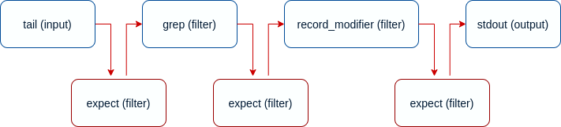

# Validating your Data and Structure

Fluent Bit is a powerful log processing tool that can deal with different sources and formats, in addition it provides several filters that can be used to perform custom modifications. This flexibility is really good but while your pipeline grows, it's strongly recommended to validate your data and structure. 

> We encourage Fluent Bit users to integrate data validation in their CI systems

A simplified view of our data processing pipeline is as follows:


In a normal production environment, many Inputs, Filters, and Outputs are defined in the configuration, so integrating a continuous validation of your configuration against expected results is a must. For this requirement, Fluent Bit provides a specific Filter called **Expect** which can be used to validate expected Keys and Values from your records and takes some action when an exception is found.

### How it Works

As an example, consider the following pipeline where your source of data is a normal file with JSON content on it and then two filters: [grep](../pipeline/filters/grep.md) to exclude certain records and [record\_modifier](../pipeline/filters/record-modifier.md) to alter the record content adding and removing specific keys.


Ideally you want to add checkpoints of validation of your data between each step so you can know if your data structure is correct, we do this by using **expect** filter.



Expect filter sets rules that aims to validate certain criteria like:

* does the record contain a key A ?
* does the record not contains key A?
* does the record key A value equals NULL ?
* does the record key A value a different value than NULL ?
* does the record key A value equals B ?

Every expect filter configuration can expose specific rules to validate the content of your records, it supports the following configuration properties:

| Property | Description |
| :--- | :--- |
| key\_exists | Check if a key with a given name exists in the record. |
| key\_not\_exists | Check if a key does not exist in the record. |
| key\_val\_is\_null | check that the value of the key is NULL. |
| key\_val\_is\_not\_null | check that the value of the key is NOT NULL. |
| key\_val\_eq | check that the value of the key equals the given value in the configuration. |
| action | action to take when a rule does not match. The available options are  `warn` or `exit`. On `warn`, a warning message is sent to the logging layer when a mismatch of the rules above is found; using `exit` makes Fluent Bit abort with status code `255`.  |

### Start Testing

Consider the following JSON file called `data.log` with the following content:

```javascript
{"color": "blue", "label": {"name": null}}
{"color": "red", "label": {"name": "abc"}, "meta": "data"}
{"color": "green", "label": {"name": "abc"}, "meta": null}
```

The following Fluent Bit configuration file will configure a pipeline to consume the log above apply an expect filter to validate that keys `color` and `label` exists:

```python
[SERVICE]
    flush        1
    log_level    info
    parsers_file parsers.conf

[INPUT]
    name        tail
    path        ./data.log
    parser      json
    exit_on_eof on
    
# First 'expect' filter to validate that our data was structured properly
[FILTER]
    name        expect
    match       *
    key_exists  color
    key_exists  $label['name']
    action      exit
    
[OUTPUT]
    name        stdout
    match       *
```

note that if for some reason the JSON parser failed or is missing in the `tail` input \(line 9\), the `expect` filter will trigger the `exit` action. As a test, go ahead and comment out or remove line 9.

As a second step, we will extend our pipeline and we will add a grep filter to match records that map  `label` contains a key called `name` with value `abc`, then an expect filter to re-validate that condition:

```python
[SERVICE]
    flush        1
    log_level    info
    parsers_file parsers.conf

[INPUT]
    name         tail
    path         ./data.log
    parser       json
    exit_on_eof  on
    
# First 'expect' filter to validate that our data was structured properly
[FILTER]
    name       expect
    match      *
    key_exists color
    key_exists label
    action     exit

# Match records that only contains map 'label' with key 'name' = 'abc'
[FILTER]
    name       grep
    match      *
    regex      $label['name'] ^abc$

# Check that every record contains 'label' with a non-null value
[FILTER]
    name       expect
    match      *
    key_val_eq $label['name'] abc
    action     exit

# Append a new key to the record using an environment variable
[FILTER]
    name       record_modifier
    match      *
    record     hostname ${HOSTNAME}
   
# Check that every record contains 'hostname' key
[FILTER]
    name       expect
    match      *
    key_exists hostname
    action     exit
     
[OUTPUT]
    name       stdout
    match      *
```

### Deploying in Production

When deploying your configuration in production, you might want to remove the expect filters from your configuration since it's an unnecessary _extra work_ unless you want to have a 100% coverage of checks at runtime. 

