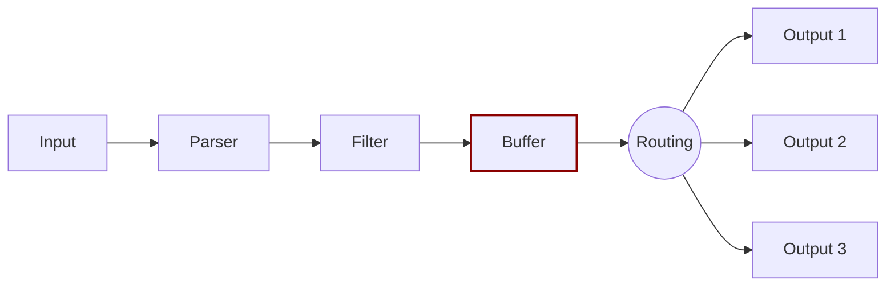

# Buffering


After Fluent Bit ingests data, it temporarily stores that data in the system memory (heap) before processing and routing that data to its destination. This process is known as _buffering_.




Buffered data uses the Fluent Bit internal binary representation, which isn't raw text. This buffered data is immutable.


## Chunks

When an input plugin emits records, the engine groups records together into a _chunk_. Each chunk has an average size of 2&nbsp;MB. The active [buffering mode](#buffering-modes) determines where these chunks are stored.

Chunks that are stored simultaneously in memory and in filesystem storage are known as `up` chunks. Chunks that are stored only in filesystem storage are known as `down` chunks. A `down` chunk becomes an `up` chunk when a copy of the `down` chunk is written to memory.

After an `up` chunk is processed and routed, the associated buffered data both in memory and in the filesystem is flushed.

### Irrecoverable chunks

Fluent Bit marks a chunk as irrecoverable in the following scenarios:

- When Fluent Bit encounters a bad layout in a chunk. A bad layout is a chunk that doesn't conform to the [expected format](https://github.com/fluent/fluent-bit/blob/master/CHUNKS.md).
- When Fluent Bit encounters an incorrect or invalid chunk header size.

After marking a chunk as irrecoverable, Fluent Bit logs an error message and then discards the irrecoverable chunk.

## Buffering modes

Fluent Bit offers two modes for storing buffered data. Both modes store buffered data in memory, but filesystem buffering is a hybrid method that stores an additional copy of buffered data in the filesystem.

You can set the buffering mode for each active [input plugin](#per-input-settings).

### Memory-only buffering

When memory-only buffering is enabled, Fluent Bit stores buffered data in memory until it's ready to process and route that data to its intended destinations. After Fluent Bit processes and routes the data, it flushes that data from memory.

This buffering method is faster than filesystem buffering, and uses less system overhead, but is more prone to data loss.

### Filesystem buffering (hybrid)

When filesystem buffering is enabled, Fluent Bit stores each chunk of buffered data in the filesystem through [mmap(2)](https://man7.org/linux/man-pages/man2/mmap.2.html). If Fluent Bit has enough space in memory, an identical chunk of that buffered data is also written to memory. If Fluent Bit doesn't have enough space in memory, the chunk of buffered data remains only in the filesystem until there is enough space to write an identical chunk to memory. After Fluent Bit processes and routes the data, it flushes that data from memory and from the filesystem.

This buffering method is less efficient than memory-only buffering, and uses more system overhead, but is less prone to data loss.

## Configuration settings


For information about different strategies for managing backpressure, see [Backpressure](../administration/backpressure.md).


Use the information in this section to configure buffering settings in Fluent Bit. Global settings configure the storage layer, per-input settings define which buffering mechanism to use, and per-output settings define limits for the logical filesystem queues.

### Global settings

In the [`service` section](../administration/configuring-fluent-bit/yaml/service-section.md) of Fluent Bit configuration files, several settings related to buffering are stored in the [`storage` key](../administration/configuring-fluent-bit/yaml/service-section.md#storage-configuration). These are global settings that affect all input and output plugins.

### Per-input settings

You can configure buffering settings for any input plugin by using these configuration parameters:

| Key | Description | Default |
| :--- | :--- | :--- |
| `storage.type` | Specifies the buffering mechanism to use for this input plugin. To enable filesystem buffering, a global [`storage.path`](../administration/configuring-fluent-bit/yaml/service-section.md#storage-configuration) value must be set in the `services` section of your configuration file. Accepted values: `memory`, `filesystem`. | `memory` |
| `mem_buf_limit` | If memory-only buffering is enabled, sets a limit for how much buffered data the plugin can write to memory. After this limit is reached, the plugin will pause until more memory becomes available. This value must follow [unit size](../../administration/configuring-fluent-bit.md#unit-sizes) specifications. If unspecified, no limit is enforced. | `0` |
| `storage.pause_on_chunks_overlimit` | If filesystem buffering is enabled, specifies how the input plugin should behave after the global `storage.max_chunks_up` limit is reached. When set to `off`, the plugin will stop buffering data to memory but continue buffering data to the filesystem. When set to `on`, the plugin will stop both memory buffering and filesystem buffering until more memory becomes available. Possible values: `on`, `off`. | `off` |

The following configuration example sets global settings in `service` to support filesystem buffering, then configures one input plugin with filesystem buffering and one input plugin with memory-only buffering:




```yaml
service:
  flush: 1
  log_level: info
  storage.path: /var/log/flb-storage/
  storage.sync: normal
  storage.checksum: off
  storage.max_chunks_up: 128
  storage.backlog.mem_limit: 5M

pipeline:
  inputs:
    - name: cpu
      storage.type: filesystem

    - name: mem
      storage.type: memory
```




```text
[SERVICE]
  flush                     1
  log_Level                 info
  storage.path              /var/log/flb-storage/
  storage.sync              normal
  storage.checksum          off
  storage.max_chunks_up     128
  storage.backlog.mem_limit 5M

[INPUT]
  name          cpu
  storage.type  filesystem

[INPUT]
  name          mem
  storage.type  memory
```




### Per-output settings

If any active input plugins use filesystem buffering, you can limit how many chunks are buffered to the filesystem based on the output plugin where Fluent Bit intends to route that chunk. To do so, use this configuration parameter:

| Key | Description | Default |
| :--- | :--- | :--- |
| `storage.total_limit_size` | Sets the size of the queue for this output plugin. This queue is the number of chunks buffered to the filesystem with this output as the intended destination. If the output plugin reaches its `storage.total_limit_size` capacity, the oldest chunk from its queue will be discarded to make room for new data. This value must follow [unit size](../../administration/configuring-fluent-bit.md#unit-sizes) specifications. | _none_ |

The following configuration example creates records with CPU usage samples in the filesystem which are delivered to Google Stackdriver service while limiting the logical queue to `5M`:




```yaml
service:
  flush: 1
  log_level: info
  storage.path: /var/log/flb-storage/
  storage.sync: normal
  storage.checksum: off
  storage.max_chunks_up: 128
  storage.backlog.mem_limit: 5M

pipeline:
  inputs:
    - name: cpu
      storage.type: filesystem

  outputs:
    - name: stackdriver
      match: '*'
      storage.total_limit_size: 5M
```




```text
[SERVICE]
  flush                     1
  log_Level                 info
  storage.path              /var/log/flb-storage/
  storage.sync              normal
  storage.checksum          off
  storage.max_chunks_up     128
  storage.backlog.mem_limit 5M

[INPUT]
  name                      cpu
  storage.type              filesystem

[OUTPUT]
  name                      stackdriver
  match                     *
  storage.total_limit_size  5M
```




In this example, if Fluent Bit is offline because of a network issue, it will continue buffering CPU samples, keeping a maximum of 5&nbsp;MB of the newest data.
