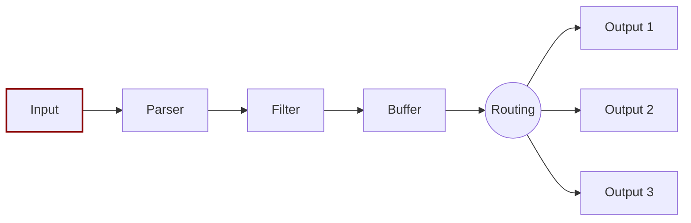

# Inputs

Input plugins gather information from different sources. Some plugins collect data from log files, while others can gather metrics information from the operating system. There are many plugins to suit different needs.

When an input plugin loads, an internal _instance_ is created. Each instance has its own independent configuration. Configuration keys are often called _properties_.
