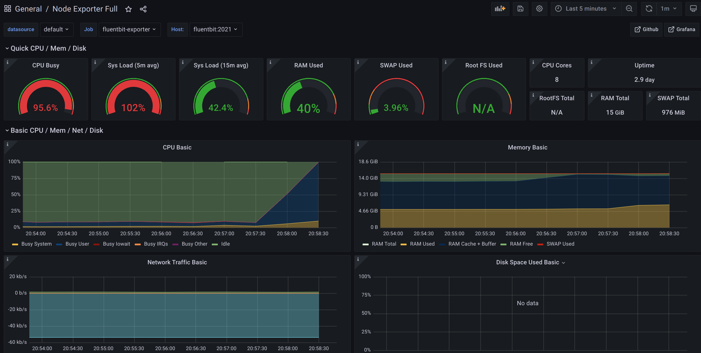

# Node exporter metrics


**Supported event types:** `metrics`


[Prometheus Node exporter](https://github.com/prometheus/node_exporter) is a popular way to collect system level metrics from operating systems, such as CPU, disk, network, and process statistics. Fluent Bit includes a node exporter metrics plugin that builds off the Prometheus design to collect system level metrics without having to manage two separate processes or agents.

The _Node exporter metrics_ plugin contains a subset of collectors and metrics available from Prometheus Node exporter.



Metrics collected with Node Exporter Metrics flow through a separate pipeline from logs and current filters don't operate on top of metrics.
This plugin is generally supported on Linux-based operating systems, with macOS offering a reduced subset of metrics.



## Configuration parameters

`scrape_interval` sets the default for all scrapes. To set granular scrape intervals, set the specific interval. For example, `collector.cpu.scrape_interval`. When using a granular scrape interval, if a value greater than `0` is used, it overrides the global default. Otherwise, the global default is used.

The plugin top-level `scrape_interval` setting is the global default. Any custom settings for individual `scrape_intervals` override that specific metric scraping interval.

Each `collector.xxx.scrape_interval` option only overrides the interval for that specific collector and updates the associated set of provided metrics.

Overridden intervals only change the collection interval, not the interval for publishing the metrics which is taken from the global setting.

For example, if the global interval is set to `5` and an override interval of `60` is used, the published metrics will be reported every five seconds. However, the specific collector will stay the same for 60 seconds until it's collected again.

This helps with down-sampling when collecting metrics.

| Key | Description | Default |
| --- | --- | --- |
| `collector.cpu.scrape_interval` | The rate in seconds at which `cpu` metrics are collected from the host operating system. | `0` |
| `collector.cpufreq.scrape_interval` | The rate in seconds at which `cpufreq` metrics are collected from the host operating system. | `0` |
| `collector.diskstats.scrape_interval` | The rate in seconds at which `diskstats` metrics are collected from the host operating system. | `0` |
| `collector.filefd.scrape_interval` | The rate in seconds at which `filefd` metrics are collected from the host operating system. | `0` |
| `collector.filesystem.scrape_interval` | The rate in seconds at which `filesystem` metrics are collected from the host operating system. | `0` |
| `collector.hwmon.chip-exclude` | Regex of chips to exclude for the `hwmon` collector. | Not set by default. |
| `collector.hwmon.chip-include` | Regex of chips to include for the `hwmon` collector. | Not set by default. |
| `collector.hwmon.scrape_interval` | The rate in seconds at which `hwmon` metrics are collected from the host operating system. | `0` |
| `collector.hwmon.sensor-exclude` | Regex of sensors to exclude for the `hwmon` collector. | Not set by default. |
| `collector.hwmon.sensor-include` | Regex of sensors to include for the `hwmon` collector. | Not set by default. |
| `collector.loadavg.scrape_interval` | The rate in seconds at which `loadavg` metrics are collected from the host operating system. | `0` |
| `collector.meminfo.scrape_interval` | The rate in seconds at which `meminfo` metrics are collected from the host operating system. | `0` |
| `collector.netdev.scrape_interval` | The rate in seconds at which `netdev` metrics are collected from the host operating system. | `0` |
| `collector.netstat.scrape_interval` | The rate in seconds at which `netstat` metrics are collected from the host operating system. | `0` |
| `collector.nvme.scrape_interval` | The rate in seconds at which `nvme` metrics are collected from the host operating system. | `0` |
| `collector.processes.scrape_interval` | The rate in seconds at which system-level `process` metrics are collected from the host operating system. | `0` |
| `collector.sockstat.scrape_interval` | The rate in seconds at which `sockstat` metrics are collected from the host operating system. | `0` |
| `collector.stat.scrape_interval` | The rate in seconds at which `stat` metrics are collected from the host operating system. | `0` |
| `collector.systemd.scrape_interval` | The rate in seconds at which `systemd` metrics are collected from the host operating system. | `0` |
| `collector.textfile.path` | Specify path or directory to collect textfile metrics from the host operating system. | Not set by default. |
| `collector.textfile.scrape_interval` | The rate in seconds at which `textfile` metrics are collected from the host operating system. | `0` |
| `collector.thermalzone.scrape_interval` | The rate in seconds at which `thermal_zone` metrics are collected from the host operating system. | `0` |
| `collector.time.scrape_interval` | The rate in seconds at which `time` metrics are collected from the host operating system. | `0` |
| `collector.timex.scrape_interval` | The rate in seconds at which `timex` metrics are collected from the host operating system. | `0` |
| `collector.uname.scrape_interval` | The rate in seconds at which `uname` metrics are collected from the host operating system. | `0` |
| `collector.vmstat.scrape_interval` | The rate in seconds at which `vmstat` metrics are collected from the host operating system. | `0` |
| `diskstats.ignore_device_regex` | Specify the regular expression for the` diskstats` to prevent collection of/ignore. | `^(ram\|loop\|fd\|(h\|s\|v\|xv)d[a-z]\|nvme\\d+n\\d+p)\\d+$` |
| `filesystem.ignore_filesystem_type_regex` | Specify the regular expression for the `filesystem` types to prevent collection of or ignore. | `^(autofs\|binfmt_misc\|bpf\|cgroup2?\|configfs\|debugfs\|devpts\|devtmpfs\|fusectl\|hugetlbfs\|iso9660\|mqueue\|nsfs\|overlay\|proc\|procfs\|pstore\|rpc_pipefs\|securityfs\|selinuxfs\|squashfs\|sysfs\|tracefs)$` |
| `filesystem.ignore_mount_point_regex` | Specify the regular expression for the `mount` points to prevent collection of/ignore. | `^/(dev\|proc\|run/credentials/.+\|sys\|var/lib/docker/.+\|var/lib/containers/storage/.+)($\|/)` |
| `metrics` | Specify which metrics are collected from the host operating system. The available collectors and their data sources depend on the operating system. On Linux, these metrics depend on `/procfs`, `/sysfs`, systemd, or custom files, and the actual values of metrics will be read from `/proc`, `/sys`, or systemd as needed: `cpu`, `cpufreq`, `meminfo`, `diskstats`, `filesystem`, `stat`, `loadavg`, `vmstat`, `netdev`, `netstat`, `sockstat`, `filefd`, `nvme`, and `processes` depend on `procfs`. `cpufreq`, `hwmon`, `thermal_zone`, and `powersupplyclass` depend on `sysfs`. `systemd` depends on systemd services. `timex` depends on the `adjtimex(2)` system call. `textfile` requires explicit path configuration using `collector.textfile.path`. On macOS, the collectors read from native system interfaces instead of `/proc` and `/sys`: `filesystem` uses `getmntinfo`, `diskstats`, `powersupplyclass`, and `thermal_zone` use `IOKit`, and `cpu`, `meminfo`, `netdev`, `loadavg`, `stat`, and `uname` use `sysctl` and related system calls. The default differs by operating system. | Linux: `"cpu,cpufreq,meminfo,diskstats,filesystem,uname,stat,time,timex,loadavg,vmstat,netdev,netstat,sockstat,filefd,systemd,nvme,thermal_zone,hwmon,powersupplyclass"`. macOS: `"cpu,loadavg,meminfo,diskstats,filesystem,uname,stat,netdev,thermal_zone,powersupplyclass"` |
| `path.procfs` | The mount point used to collect process information and metrics. | `/proc` |
| `path.rootfs` | The root filesystem mount point. | `/` |
| `path.sysfs` | The path in the filesystem used to collect system metrics. | `/sys` |
| `scrape_interval` | The rate in seconds at which metrics are collected from the host operating system. | `5` |
| `systemd_exclude_pattern` | Regular expression to determine which units are excluded in the metrics produced by the `systemd` collector. | `.+\\.(automount\|device\|mount\|scope\|slice)` |
| `systemd_include_pattern` | Regular expression to determine which units are included in the metrics produced by the `systemd` collector. | Not applied unless explicitly set. |
| `systemd_include_service_task_metrics` | Determines if the collector will include service task metrics. | `false` |
| `systemd_service_restart_metrics` | Determines if the collector will include service restart metrics. | `false` |
| `systemd_unit_start_time_metrics` | Determines if the collector will include unit start time metrics. | `false` |

## Collectors available

The following table describes the available collectors as part of this plugin. They respect the original metrics name, descriptions, and types from Prometheus Exporter, so you can use your current dashboards without any compatibility problem.

Most collectors are enabled by default. The `metrics` parameter lists the exact set enabled for your operating system. The `textfile` collector also requires `collector.textfile.path` to be set before it produces anything.

The Version column specifies the Fluent Bit version where the collector is available.

| Name               | Description                                                                                                                                                                        | Operating system | Version                    |
|--------------------|------------------------------------------------------------------------------------------------------------------------------------------------------------------------------------|------------------|----------------------------|
| `cpu`              | Exposes CPU statistics.                                                                                                                                                            | Linux, macOS     | 1.8                        |
| `cpufreq`          | Exposes CPU frequency statistics.                                                                                                                                                  | Linux            | 1.8                        |
| `diskstats`        | Exposes disk I/O statistics.                                                                                                                                                       | Linux, macOS     | 1.8                        |
| `filefd`           | Exposes file descriptor statistics from `/proc/sys/fs/file-nr`.                                                                                                                    | Linux            | 1.8.2                      |
| `filesystem`       | Exposes filesystem statistics from `/proc/*/mounts` on Linux, and from `getmntinfo` on macOS.                                                                                      | Linux, macOS     | Linux: 2.0.9, macOS: 5.1   |
| `hwmon`            | Exposes hardware monitoring metrics from `/sys/class/hwmon`.                                                                                                                       | Linux            | 2.2.0                      |
| `loadavg`          | Exposes load average.                                                                                                                                                              | Linux, macOS     | 1.8                        |
| `meminfo`          | Exposes memory statistics.                                                                                                                                                         | Linux, macOS     | 1.8                        |
| `netdev`           | Exposes network interface statistics such as bytes transferred. See [Network interface metric expiration](#network-interface-metric-expiration).                                   | Linux, macOS     | 1.8.2                      |
| `netstat`          | Exposes network statistics from `/proc/net/netstat`, including the `TcpExt` and `IpExt` counters.                                                                                  | Linux            | 2.2.0                      |
| `nvme`             | Exposes `nvme` statistics from `/proc`.                                                                                                                                            | Linux            | 2.2.0                      |
| `powersupplyclass` | Exposes power supply statistics, such as battery capacity and charge state, from `/sys/class/power_supply` on Linux and from `IOKit` on macOS.                                     | Linux, macOS     | 5.1                        |
| `processes`        | Exposes processes statistics from `/proc`.                                                                                                                                         | Linux            | 2.2.0                      |
| `sockstat`         | Exposes socket statistics from `/proc/net/sockstat`.                                                                                                                               | Linux            | 2.2.0                      |
| `stat`             | Exposes various statistics from `/proc/stat` on Linux, including boot time, forks, and interruptions. On macOS, only boot time is exposed, read from the `kern.boottime` `sysctl`. | Linux, macOS     | Linux: 1.8, macOS: 5.1.2   |
| `systemd`          | Exposes statistics from `systemd`.                                                                                                                                                 | Linux            | 2.1.3                      |
| `textfile`         | Exposes custom metrics from text files. Requires `collector.textfile.path` to be set.                                                                                              | Linux            | 2.2.0                      |
| `thermal_zone`     | Exposes thermal statistics from `/sys/class/thermal/thermal_zone/*` on Linux, and from `IOKit` on macOS. See [macOS thermal metrics](#macos-thermal-metrics).                      | Linux, macOS     | Linux: 2.2.1, macOS: 5.1.2 |
| `time`             | Exposes the current system time.                                                                                                                                                   | Linux            | 1.8                        |
| `timex`            | Exposes selected `adjtimex(2)` system call stats.                                                                                                                                  | Linux            | 5.1                        |
| `uname`            | Exposes system information as provided by the `uname` system call.                                                                                                                 | Linux, macOS     | 1.8                        |
| `vmstat`           | Exposes statistics from `/proc/vmstat`.                                                                                                                                            | Linux            | 1.8.2                      |

### macOS thermal metrics

macOS support for the `thermal_zone` collector is available in Fluent Bit version 5.1.2 and greater.

macOS has no `/sys/class/thermal` equivalent, so the collector reads `IOKit` instead and exposes a different set of metrics than it does on Linux:

| Metric | Description |
| ------ | ----------- |
| `node_thermal_temperature_celsius` | Temperature of a thermal sensor in Celsius. Carries a `sensor` label holding the sensor's product name. |
| `node_thermal_cpu_scheduler_limit_ratio` | Fraction of CPU time available to the scheduler, where `1` means no limit is applied. |
| `node_thermal_cpu_available_cpu` | Number of processors still online, reflecting how many the system has taken offline. |
| `node_thermal_cpu_speed_limit_ratio` | Fraction of the maximum CPU speed the current speed and voltage limits allow, where `1` means no limit is applied. |

`node_thermal_temperature_celsius` is only reported on ARM64 (Apple silicon) hardware. The collector doesn't read thermal sensors on Intel-based macOS, so the metric is registered but never produces samples there.

The three `cpu_` metrics come from the operating system's CPU power status, which macOS only reports when a limit has been recorded. They're absent until then, and each is created individually, so you might see some of the three before the others. The ratios are reported as fractions between `0` and `1` rather than as percentages.

A sensor that doesn't report a product name is labeled `Unknown #N`, where `N` counts the unnamed sensors found during that scrape.

### Network interface metric expiration

Network interface metric expiration is available in Fluent Bit version 5.1.2 and greater.

Every time the `netdev` collector runs, it removes the metrics for any network interface it didn't observe during that scan. Expiration applies to each interface separately, so the interfaces still present keep reporting as usual.

In earlier versions, an interface that went away kept its last known values in every following scrape. The set of reported interfaces then grew without bound on hosts that create and destroy interfaces frequently, such as container hosts with short-lived virtual interfaces. Consumers also couldn't tell a departed interface from an idle one.

Because a departed interface stops producing samples instead of repeating its final value, a time series for that interface ends rather than flattening. Queries that expect a continuous series for every interface the host has ever had need to account for series that stop.

This behavior applies to the `netdev` collector on both Linux and macOS. Other collectors are unaffected.

## Threading

This input always runs in its own [thread](../../administration/multithreading.md#inputs).

## Get started

### Configuration file

In the following configuration file, the input plugin `node_exporter_metrics` collects metrics every two seconds and exposes them through the [Prometheus Exporter](../outputs/prometheus-exporter.md) output plugin on HTTP/TCP port 2021.




```yaml
# Node Exporter Metrics + Prometheus Exporter
# -------------------------------------------
# The following example collect host metrics on Linux and expose
# them through a Prometheus HTTP endpoint.
#
# After starting the service try it with:
#
# $ curl http://127.0.0.1:2021/metrics
#
service:
  flush: 1
  log_level: info

pipeline:
  inputs:
    - name: node_exporter_metrics
      tag:  node_metrics
      scrape_interval: 2

  outputs:
    - name: prometheus_exporter
      match: node_metrics
      host: 0.0.0.0
      port: 2021
```




```text

# Node Exporter Metrics + Prometheus Exporter
# -------------------------------------------
# The following example collect host metrics on Linux and expose
# them through a Prometheus HTTP end-point.
#
# After starting the service try it with:
#
# $ curl http://127.0.0.1:2021/metrics
#
[SERVICE]
  Flush           1
  Log_Level       info

[INPUT]
  Name            node_exporter_metrics
  Tag             node_metrics
  Scrape_Interval 2

[OUTPUT]
  Name            prometheus_exporter
  Match           node_metrics
  Host            0.0.0.0
  Port            2021


```




You can test the expose of the metrics by using `curl`:

```shell
curl http://127.0.0.1:2021/metrics
```

### Container to collect host metrics

When deploying Fluent Bit in a container you will need to specify additional settings to ensure that Fluent Bit has access to the host operating system. The following Docker command deploys Fluent Bit with specific mount paths and settings enabled to ensure that Fluent Bit can collect from the host. These are then exposed over port `2021`.

```shell
docker run -ti -v /proc:/host/proc \
           -v /sys:/host/sys   \
           -p 2021:2021        \
           fluent/fluent-bit:1.8.0 \
           /fluent-bit/bin/fluent-bit \
           -i node_exporter_metrics \
           -p path.procfs=/host/proc \
           -p path.sysfs=/host/sys \
           -o prometheus_exporter \
           -p "add_label=host $HOSTNAME" \
           -f 1
```

### Fluent Bit with Prometheus and Grafana

If you use dashboards for monitoring, Grafana is one option. The Fluent Bit source code repository contains a `docker-compose` example.

1. Download the Fluent Bit source code:

   ```shell
   git clone https://github.com/fluent/fluent-bit

   cd fluent-bit/docker_compose/node-exporter-dashboard/
   ```

2. Start the service and view your dashboard:

   ```shell
   docker-compose up --force-recreate -d --build
   ```

3. Open your browser and use the address `http://127.0.0.1:3000`.

4. When asked for the credentials to access Grafana, use `admin` for the username and
   password. See [Sign in to Grafana](https://grafana.com/docs/grafana/latest/setup-grafana/sign-in-to-grafana/).



By default, Grafana dashboard plots the data from the last 24 hours. Change it to **Last 5 minutes** to see the recent data being collected.

#### Stop the service

```shell
docker-compose down
```

## Enhancement requests

The plugin implements a subset of the available collectors in the original Prometheus Node exporter. If you would like a specific collector prioritized, open a GitHub issue by using the following template:

- [`in_node_exporter_metrics`](https://github.com/fluent/fluent-bit/issues/new?assignees=\&labels=\&template=feature_request.md\&title=in_node_exporter_metrics:%20add%20ABC%20collector)
