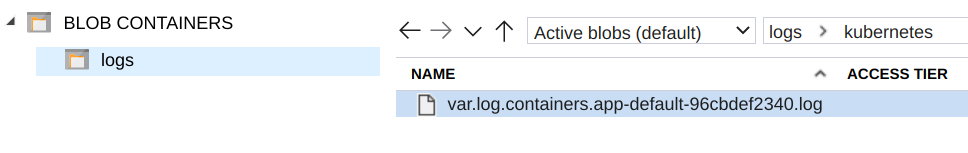

# Azure Blob

The Azure Blob output plugin allows ingesting your records into [Azure Blob Storage](https://azure.microsoft.com/en-us/services/storage/blobs/) service. This connector is designed to use the Append Blob and Block Blob API.

The Fluent Bit plugin works with the official Azure Service and can be configured to be used with a service emulator such as [Azurite](https://github.com/Azure/Azurite).

## Azure Storage account

Ensure you have an Azure Storage account. [Azure Blob Storage Tutorial \(Video\)](https://www.youtube.com/watch?v=-sCKnOm8G_g) explains how to set up your account.

## Configuration parameters

Fluent Bit exposes the following configuration properties.

| Key                          | Description                                                                                                                                                                                                                  | Default                       |
| :--------------------------- | :--------------------------------------------------------------------------------------------------------------------------------------------------------------------------------------------------------------------------- | :---------------------------- |
| `account_name`               | Azure Storage account name.                                                                                                                                                                                                  | _none_                        |
| `auth_type`                  | Specify the type to authenticate against the service. Supported values: `key`, `sas`.                                                                                                                                        | `key`                         |
| `shared_key`                 | Specify the Azure Storage Shared Key to authenticate against the service. This configuration property is mandatory when `auth_type` is `key`.                                                                                | _none_                        |
| `sas_token`                  | Specify the Azure Storage shared access signatures to authenticate against the service. This configuration property is mandatory when `auth_type` is `sas`.                                                                  | _none_                        |
| `container_name`             | Name of the container that will contain the blobs.                                                                                                                                                                           | _none_                        |
| `blob_type`                  | Specify the desired blob type. Supported values: `appendblob`, `blockblob`.                                                                                                                                                  | `appendblob`                  |
| `auto_create_container`      | If `container_name` doesn't exist in the remote service, enabling this option handles the exception and auto-creates the container.                                                                                          | `on`                          |
| `path`                       | Optional. The path to store your blobs. If your blob name is `myblob`, specify subdirectories for storage using `path`. For example, setting `path` to `/logs/kubernetes` will store your blob in `/logs/kubernetes/myblob`. | _none_                        |
| `compress`                   | Sets payload compression in network transfer. Supported value: `gzip`                                                                                                                                                        | _none_                        |
| `compress_blob`              | Enables GZIP compression in the final `blockblob` file. This option isn't compatible when `blob_type` = `appendblob`.                                                                                                        | _none_                        |
| `emulator_mode`              | To send data to an Azure emulator service like [Azurite](https://github.com/Azure/Azurite), enable this option to format the requests in the expected format.                                                                | `off`                         |
| `endpoint`                   | When using an emulator, this option lets you specify the absolute HTTP address of such service. For example, `http://127.0.0.1:10000`.                                                                                       | _none_                        |
| `tls`                        | Enable or disable TLS encryption. Azure service requires this to be set to `on`.                                                                                                                                             | `off`                         |
| `workers`                    | The number of [workers](../../administration/multithreading.md#outputs) to perform flush operations for this output.                                                                                                         | `0`                           |
| `buffering_enabled`          | Enable buffering into disk before ingesting into Azure Blob.                                                                                                                                                                 | `false`                       |
| `buffer_dir`                 | Specifies the location of directory where the buffered data will be stored.                                                                                                                                                  | `/tmp/fluent-bit/azure-blob/` |
| `upload_timeout`             | Optional. Specify a timeout for uploads. Fluent Bit will start ingesting buffer files which have been created more than `x` minutes and ago haven't reached `upload_file_size` limit yet.                                    | `30m`                         |
| `upload_file_size`           | Specifies the size of files to be uploaded in MB.                                                                                                                                                                            | `200M`                        |
| `azure_blob_buffer_key`      | Set the Azure Blob buffer key which needs to be specified when using multiple instances of Azure Blob output plugin and buffering is enabled.                                                                                | `key`                         |
| `store_dir_limit_size`       | Set the max size of the buffer directory.                                                                                                                                                                                    | `8G`                          |
| `buffer_file_delete_early`   | Whether to delete the buffered file early after successful blob creation.                                                                                                                                                    | `false`                       |
| `blob_uri_length`            | Set the length of generated blob URI before ingesting to Azure Kusto.                                                                                                                                                        | `64`                          |
| `unify_tag`                  | Whether to create a single buffer file when buffering mode is enabled.                                                                                                                                                       | `false`                       |
| `scheduler_max_retries`      | Maximum number of retries for the scheduler send blob.                                                                                                                                                                       | `3`                           |
| `delete_on_max_upload_error` | Whether to delete the buffer file on maximum upload errors.                                                                                                                                                                  | `false`                       |
| `io_timeout`                 | HTTP IO timeout.                                                                                                                                                                                                             | `60s`                         |

## Get started

Fluent Bit can deliver records to the official service or an emulator.

### Configuration for Azure Storage Service

The following configuration example generates a random message with a custom tag:




```yaml
service:
  flush: 1
  log_level: info

pipeline:
  inputs:
    - name: dummy
      dummy: '{"name": "Fluent Bit", "year": 2020}'
      samples: 1
      tag: var.log.containers.app-default-96cbdef2340.log

  outputs:
    - name: azure_blog
      match: "*"
      account_name: YOUR_ACCOUNT_NAME
      shared_key: YOUR_SHARED_KEY
      path: kubernetes
      container_name: logs
      auto_create_container: on
      tls: on
```




```text
[SERVICE]
  flush     1
  log_level info

[INPUT]
  name      dummy
  dummy     {"name": "Fluent Bit", "year": 2020}
  samples   1
  tag       var.log.containers.app-default-96cbdef2340.log

[OUTPUT]
  name                  azure_blob
  match                 *
  account_name          YOUR_ACCOUNT_NAME
  shared_key            YOUR_SHARED_KEY
  path                  kubernetes
  container_name        logs
  auto_create_container on
  tls                   on
```




After you run the configuration file, you will be able to query the data using the Azure Storage Explorer. The example generates the following content in the explorer:



### Configuring and using Azure Emulator: Azurite

#### Install and run Azurite

1. Install Azurite using `npm`:

   ```shell
   npm install -g azurite
   ```

1. Run the service:

   ```shell
   azurite
   ```

   The command should return results similar to:

   ```text
    Azurite Blob service is starting at http://127.0.0.1:10000
    Azurite Blob service is successfully listening at http://127.0.0.1:10000
    Azurite Queue service is starting at http://127.0.0.1:10001
    Azurite Queue service is successfully listening at http://127.0.0.1:10001
   ```

#### Configuring Fluent Bit for Azurite

[Azurite](https://github.com/Azure/Azurite) comes with a default `account_name` and `shared_key`. Instead of the defaults, be sure to use the specific values provided in the following example:




```yaml
service:
  flush: 1
  log_level: info

pipeline:
  inputs:
    - name: dummy
      dummy: '{"name": "Fluent Bit", "year": 2020}'
      samples: 1
      tag: var.log.containers.app-default-96cbdef2340.log

  outputs:
    - name: azure_blog
      match: "*"
      account_name: INSERT_ACCOUNT_NAME
      shared_key: INSERT_SHARED_KEY
      path: kubernetes
      container_name: logs
      auto_create_container: on
      tls: off
      emulator_mode: on
      endpoint: http://127.0.0.1:10000
```




```text
[SERVICE]
  flush     1
  log_level info

[INPUT]
  name      dummy
  dummy     {"name": "Fluent Bit", "year": 2020}
  samples   1
  tag       var.log.containers.app-default-96cbdef2340.log

[OUTPUT]
  name                  azure_blob
  match                 *
  account_name          INSERT_ACCOUNT_NAME
  shared_key            INSERT_SHARED_KEY
  path                  kubernetes
  container_name        logs
  auto_create_container on
  tls                   off
  emulator_mode         on
  endpoint              http://127.0.0.1:10000
```




After running the Fluent Bit configuration, you will see the data flowing into Azurite:

```shell
$ azurite

Azurite Blob service is starting at http://127.0.0.1:10000
Azurite Blob service is successfully listening at http://127.0.0.1:10000
Azurite Queue service is starting at http://127.0.0.1:10001
Azurite Queue service is successfully listening at http://127.0.0.1:10001
127.0.0.1 - - [03/Sep/2020:17:40:03 +0000] "GET /devstoreaccount1/logs?restype=container HTTP/1.1" 404 -
127.0.0.1 - - [03/Sep/2020:17:40:03 +0000] "PUT /devstoreaccount1/logs?restype=container HTTP/1.1" 201 -
127.0.0.1 - - [03/Sep/2020:17:40:03 +0000] "PUT /devstoreaccount1/logs/kubernetes/var.log.containers.app-default-96cbdef2340.log?comp=appendblock HTTP/1.1" 404 -
127.0.0.1 - - [03/Sep/2020:17:40:03 +0000] "PUT /devstoreaccount1/logs/kubernetes/var.log.containers.app-default-96cbdef2340.log HTTP/1.1" 201 -
127.0.0.1 - - [03/Sep/2020:17:40:04 +0000] "PUT /devstoreaccount1/logs/kubernetes/var.log.containers.app-default-96cbdef2340.log?comp=appendblock HTTP/1.1" 201 -
```