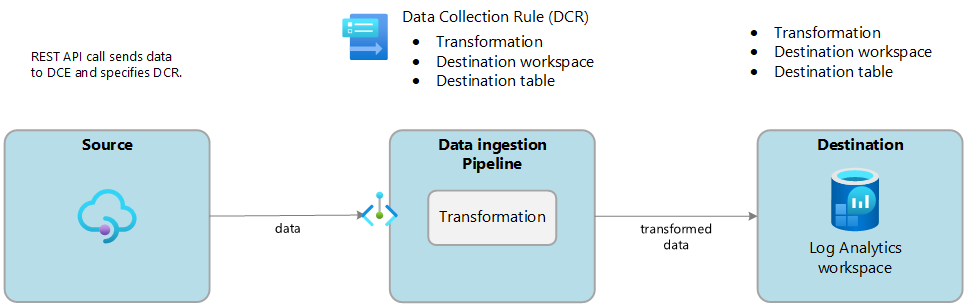

# Azure Logs Ingestion API

Azure Logs Ingestion plugin allows you to ingest your records using [Logs Ingestion API in Azure Monitor](https://learn.microsoft.com/en-us/azure/azure-monitor/logs/logs-ingestion-api-overview) to supported [Azure tables](https://learn.microsoft.com/en-us/azure/azure-monitor/logs/logs-ingestion-api-overview#supported-tables) or to [custom tables](https://learn.microsoft.com/en-us/azure/azure-monitor/logs/create-custom-table#create-a-custom-table) that you create.

The Logs ingestion API requires the following components:

- A Data Collection Endpoint (DCE)
- A Data Collection Rule (DCR) and
- A Log Analytics Workspace

> Note: According to [this document](https://github.com/MicrosoftDocs/azure-docs/blob/main/articles/azure-monitor/logs/logs-ingestion-api-overview.md#components), all resources should be in the same region.

To visualize basic Logs Ingestion operation, see the following image:



To get more details about how to set up these components, please refer to the following documentations:

- [Azure Logs Ingestion API](https://docs.microsoft.com/en-us/azure/log-analytics/)
- [Send data to Azure Monitor Logs with Logs ingestion API (setup DCE, DCR and Log Analytics)](https://learn.microsoft.com/en-us/azure/azure-monitor/logs/tutorial-logs-ingestion-portal)

## Configuration Parameters

| Key           | Description                | Default |
| :------------ | :------------------------- | :------ |
| tenant\_id    | _Required_ - The tenant ID of the AAD application. ||
| client\_id    | _Required_ - The client ID of the AAD application. ||
| client\_secret| _Required_ - The client secret of the AAD application ([App Secret](https://docs.microsoft.com/en-us/azure/active-directory/develop/howto-create-service-principal-portal#option-2-create-a-new-application-secret)). ||
| dce\_url      | _Required_ - Data Collection Endpoint(DCE) URL. ||
| dcr\_id       | _Required_ - Data Collection Rule (DCR) immutable ID (see [this document](https://learn.microsoft.com/en-us/azure/azure-monitor/logs/tutorial-logs-ingestion-portal#collect-information-from-the-dcr) to collect the immutable id) ||
| table\_name   | _Required_ - The name of the custom log table (include the `_CL` suffix as well if applicable) ||
| time\_key     | _Optional_ - Specify the key name where the timestamp will be stored. | `@timestamp` |
| time\_generated | _Optional_ - If enabled, will generate a timestamp and append it to JSON. The key name is set by the 'time_key' parameter. | `true` |
| compress      | _Optional_ - Enable HTTP payload gzip compression. | `true` |
| workers | The number of [workers](../../administration/multithreading.md#outputs) to perform flush operations for this output. | `0` |

## Getting Started

To send records into an Azure Log Analytics using Logs Ingestion API the following resources needs to be created:

- A Data Collection Endpoint (DCE) for ingestion
- A Data Collection Rule (DCR) for data transformation
- Either an [Azure tables](https://learn.microsoft.com/en-us/azure/azure-monitor/logs/logs-ingestion-api-overview#supported-tables) or [custom tables](https://learn.microsoft.com/en-us/azure/azure-monitor/logs/create-custom-table#create-a-custom-table)
- An app registration with client secrets (for DCR access).

You can follow [this guideline](https://learn.microsoft.com/en-us/azure/azure-monitor/logs/tutorial-logs-ingestion-portal) to set up the DCE, DCR, app registration and a custom table.

### Configuration File

Use this configuration to quickly get started:




```yaml
pipeline:
  inputs:
    - name: tail
      path: /path/to/your/sample.log
      tag: sample
      key: RawData      
    
    # Or use other plugins  
    #- name: cpu
    #  tag: sample

  filters:
    - name: modify
      match: sample
      # Add a json key named "Application":"fb_log"
      add: Application fb_log
      
  outputs:
    # Enable this section to see your json-log format
    #- name: stdout
    #  match: '*'
    
    - name: azure_logs_ingestion
      match: sample
      client_id: XXXXXXXX-xxxx-yyyy-zzzz-xxxxyyyyzzzzxyzz
      client_secret: some.secret.xxxzzz
      tenant_id: XXXXXXXX-xxxx-yyyy-zzzz-xxxxyyyyzzzzxyzz
      dce_url: https://log-analytics-dce-XXXX.region-code.ingest.monitor.azure.com
      dcr_id: dcr-xxxxxxxxxxxxxxxxxxxxxxxxxxxxxxxxx
      table_name: ladcr_CL
      time_generated: true
      time_key: Time
      compress: true
```




```text
[INPUT]
  Name    tail
  Path    /path/to/your/sample.log
  Tag     sample
  Key     RawData

# Or use other plugins
#[INPUT]
#  Name    cpu
#  Tag     sample

[FILTER]
  Name modify
  Match sample
  # Add a json key named "Application":"fb_log"
  Add Application fb_log

# Enable this section to see your json-log format
#[OUTPUT]
#  Name stdout
#  Match *

[OUTPUT]
  Name            azure_logs_ingestion
  Match           sample
  client_id       XXXXXXXX-xxxx-yyyy-zzzz-xxxxyyyyzzzzxyzz
  client_secret   some.secret.xxxzzz
  tenant_id       XXXXXXXX-xxxx-yyyy-zzzz-xxxxyyyyzzzzxyzz
  dce_url         https://log-analytics-dce-XXXX.region-code.ingest.monitor.azure.com
  dcr_id          dcr-xxxxxxxxxxxxxxxxxxxxxxxxxxxxxxxxx
  table_name      ladcr_CL
  time_generated  true
  time_key        Time
  Compress        true
```




Set up your DCR transformation accordingly based on the json output from fluent-bit's pipeline (input, parser, filter, output).