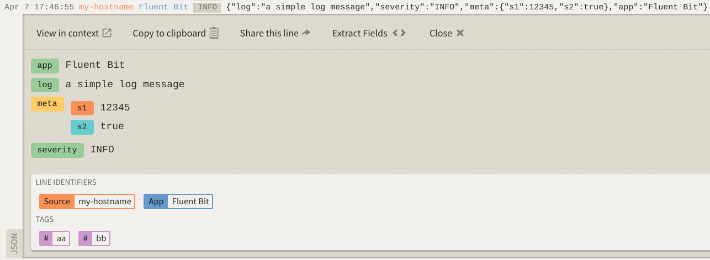

# LogDNA

The _LogDNA_ output plugin sends logs and events to a LogDNA-compliant service.

## Configuration parameters

This plugin uses the following configuration parameters:

| Key | Description | Default |
| --- | ----------- | ------- |
| `logdna_host` | The LogDNA API host address. | `logs.logdna.com` |
| `logdna_port` | The LogDNA TCP Port. | `443` |
| `logdna_endpoint` | The LogDNA ingestion endpoint. | `/logs/ingest` |
| `api_key` | Required. The API key to get access to the service. | _none_ |
| `hostname` | Name of the local machine or device where Fluent Bit is running. If no value is specifies, Fluent Bit will look up the hostname and auto populate its value. If Fluent Bit is unable to find a value, it will set the value `unknown` instead. | _none_ |
| `mac` | The MAC address. This value is optional. |  |
| `ip` | The IP address of the local hostname. This value is optional. |  |
| `tags` | A list of comma-separated strings to group records in LogDNA and simplify the query with filters. | _none_ |
| `file` | Optional name of a file being monitored. This value is only set if the record doesn't contain a reference to it. | _none_ |
| `app` | Name of the application. This value is automatically discovered on each record. If no value is found, the default value is used. | `Fluent Bit` |
| `workers` | The number of [workers](../administration/multithreading#outputs) to perform flush operations for this output. | `0` |

## Data discovery and enrichment

The LogDNA output plugin can automatically discover and enrich records with additional content.

When the login processes a record or log, it searches for specific key names that might contain context for the record in question. The following table describe these keys and the discovery logic:

| Key | Description |
| :--- | :--- |
| `level` | If the record contains a key called `level` or `severity`, it will populate the context `level` key with that value. If not found, the context key is not set. |
| `file` | If the record contains a key called `file`, it will populate the context `file` with the value found. Otherwise, if the plugin configuration provided a `file` property, that value will be used instead. |
| `app` | If the record contains a key called `app`, it will populate the context `app` with the value found, otherwise it will use the value set for `app` in the configuration property. |
| `meta` | if the record contains a key called `meta`, it will populate the context `meta` with the value found. |

## Example configuration

The following example configuration uses a `dummy` input and `logdna` output.




```yaml
service:
  flush: 1
  log_level: info

pipeline:
  inputs:
    - name: dummy
      dummy: '{"log":"a simple log message", "severity": "INFO", "meta": {"s1": 12345, "s2": true}, "app": "Fluent Bit"}'
      samples: 1

  outputs:
    - name: logdna
      match: '*'
      api_key: YOUR_API_KEY_HERE
      hostname: my-hostname
      ip: 192.168.1.2
      mac: aa:bb:cc:dd:ee:ff
      tags: aa, bb
```




```text
[SERVICE]
    flush     1
    log_level info

[INPUT]
    name      dummy
    dummy     {"log":"a simple log message", "severity": "INFO", "meta": {"s1": 12345, "s2": true}, "app": "Fluent Bit"}
    samples   1

[OUTPUT]
    name      logdna
    match     *
    api_key   YOUR_API_KEY_HERE
    hostname  my-hostname
    ip        192.168.1.2
    mac       aa:bb:cc:dd:ee:ff
    tags      aa, bb
```




Run Fluent Bit with the new configuration file:

```shell
# For YAML configuration.
fluent-bit --config fluent-bit.yaml

# For classic configuration.
fluent-bit --config fluent-bit.conf
```

Fluent Bit output:

```text
...
[2020/04/07 17:44:37] [ info] [engine] started (pid=2157706)
[2020/04/07 17:44:37] [ info] [output:logdna:logdna.0] configured, hostname=monox-fluent-bit-2
[2020/04/07 17:44:37] [ info] [sp] stream processor started
[2020/04/07 17:44:38] [ info] [output:logdna:logdna.0] logs.logdna.com:443, HTTP status=200
{"status":"ok","batchID":"f95849a8-ec6c-4775-9d52-30763604df9b:40710:ld72"}
...
```

Your record will be available and visible in your LogDNA dashboard after a few seconds.

### Query your data in LogDNA

In your LogDNA dashboard, go to the top filters and mark the Tags `aa` and `bb`, then you will be able to see your records as shown:


