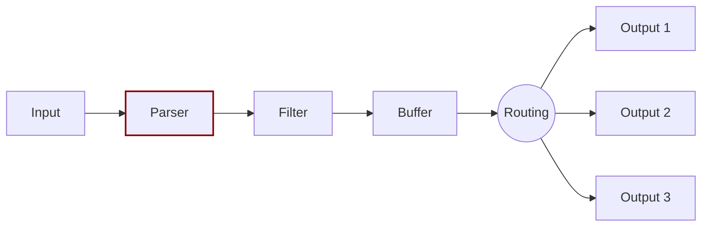

# Parsers

You can use parsers to transform unstructured log entries into structured log entries.



For example, a parser can turn an unstructured log entry like this:

```text
192.168.2.20 - - [28/Jul/2006:10:27:10 -0300] "GET /cgi-bin/try/ HTTP/1.0" 200 3395
```

...into a structured JSON object like this:

```json
{
  "host":    "192.168.2.20",
  "user":    "-",
  "method":  "GET",
  "path":    "/cgi-bin/try/",
  "code":    "200",
  "size":    "3395",
  "referer": "",
  "agent":   ""
 }
```

## How parsers work

Parsers modify the data ingested by input plugins. This modification happens before Fluent Bit applies any [filters](../pipeline/filters.md) or [processors](../pipeline/processors.md) to that data.

Each input plugin can have one active parser. Multiple plugins within the same Fluent Bit configuration file can use the same parser or use different parsers from each other.

### Default parsers and custom parsers

Fluent Bit includes a variety of [default parsers](https://github.com/fluent/fluent-bit/blob/master/conf/parsers.conf) for parsing common data formats, like Apache and Docker logs. You can also [define custom parsers](../administration/configuring-fluent-bit/yaml/parsers-section.md).

## Add a parser to an input plugin

To add a parser to an input plugin, follow these steps.

1. Either identify the name of the [default parser](https://github.com/fluent/fluent-bit/blob/master/conf/parsers.conf) you want to use, or [define a custom parser](../administration/configuring-fluent-bit/yaml/parsers-section.md) with your desired [configuration settings](../pipeline/parsers/configuring-parser.md).

1. Add a `parsers` key to the plugin's settings in the [`inputs`](../administration/configuring-fluent-bit/yaml/pipeline-section.md#inputs) section of your YAML configuration file.

For example, the following configuration file adds the default [`apache` parser](https://github.com/fluent/fluent-bit/blob/master/conf/parsers.conf#L2) to one input plugin and a custom parser named `custom_parser1` to another input plugin:





```yaml
pipeline:
  inputs:
    - name: tail
      path: /input/input.log
      refresh_interval: 1
      parser: apache

    - name: http
      listen: 0.0.0.0
      port: 8888
      parser: custom_parser1
```



