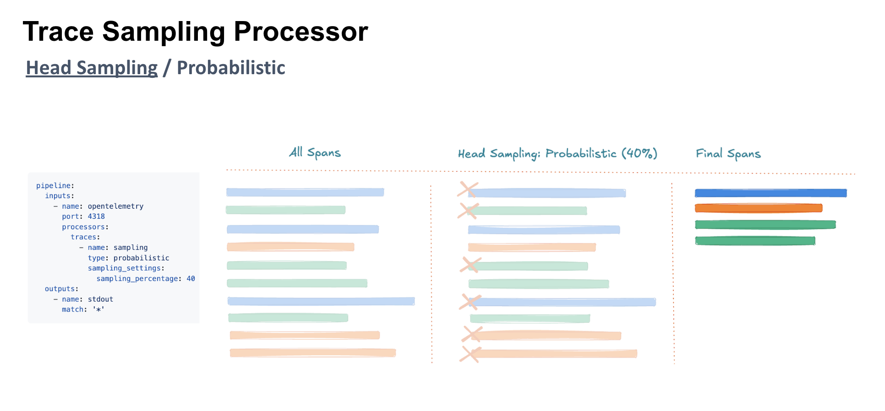
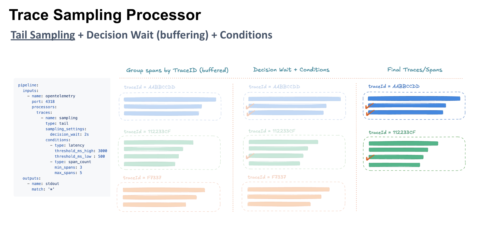

# Sampling

The _sampling_ processor uses an extendable architecture that supports multiple trace sampling strategies and backends. It provides you with the ability to apply head or tail sampling to incoming trace telemetry data.



Only [YAML configuration files](../administration/configuring-fluent-bit/yaml/README.md) support processors.



## Configuration parameters

This processor uses the following configuration parameters:

| Key | Description |
| --- | ----------- |
| `type` | The type of sampling to perform. Possible values: `probabilistic` ([head sampling](#head-sampling)) or `tail` ([tail sampling](#tail-sampling)). |
| `sampling_settings` | Contains key/value pairs for different sampling settings. These settings vary by `type`. |
| `conditions` | An array of objects where each object specifies a different [condition](#conditions) for `tail` sampling. The possible items in each object vary by `conditions.type`. |

## Head sampling

Head sampling makes the decision whether or not to keep a trace at the very beginning of its ingestion. This is when a root span is created but before the request is actually fulfilled.



Head sampling uses the following `sampling_settings` configuration parameters:

| Key | Description |
| --- | :---------- |
| `sampling_percentage` | Sets the probability of sampling trace. Must be a value between `0` and `100`. For example, `40` samples 40% of traces randomly. |

This example uses head sampling to process a smaller percentage of the overall ingested traces and spans. It accomplishes this by setting up the pipeline to ingest on the OpenTelemetry defined port using the OpenTelemetry Protocol (OTLP). The `processor` section defines traces for head sampling and the percentage of traces and spans to forward to the specified output plugins.




```yaml
service:
    flush: 1
    log_level: info
    hot_reload: on

pipeline:
    inputs:
        - name: opentelemetry
          port: 4318

          processors:
              traces:
                  # Head sampling of traces (percentage)
                  - name: sampling
                    type: probabilistic
                    sampling_settings:
                      sampling_percentage: 40

    outputs:
        - name: stdout
          match: "*"
```




With this head sampling configuration, a sample set of ingested traces will randomly send 40% of the total traces to standard output.

## Tail sampling

Tail sampling offers a more selective and fine-grained control over the collection of traces and spans. It evaluates the entire trace when making a sampling decision and can inspect the metadata and status of traces to inform the decision.



Tail sampling uses the following `sampling_settings` configuration parameters:

| Key | Description | Default |
| --- | :---------- | ------- |
| `decision_wait` | Specifies how long to buffer spans before making a sampling decision, allowing full trace evaluation. | `30s` |
| `max_traces` | Specifies the maximum number of traces that can be held in memory. When the limit is reached, the oldest trace is deleted. | _none_ |

### Conditions

Tail sampling supports different conditions. These conditions determine whether a trace meets specified criteria.

The following condition are available:

- [Latency](#latency)
- [Span count](#span-count)
- [Status code](#status-code)
- [String attribute](#string-attribute)
- [Numeric attribute](#numeric-attribute)
- [Boolean attribute](#boolean-attribute)
- [Trace state](#trace-state)

#### Latency

This condition samples traces based on span duration. It uses `threshold_ms_low` to capture short traces and `threshold_ms_high` for long traces.

The latency condition uses the following `conditions` configuration parameters:

| Key | Description | Default |
| --- | ----------- | --------|
| `type` | Sets the condition type. For the latency condition, this value must be `latency`. | _none_ |
| `threshold_ms_low` | Specifies the lower latency threshold. Traces with a duration less than or equal to this value will be sampled. | `0` |
| `threshold_ms_high` | Specifies the upper latency threshold. Traces with a duration greater than or equal to this value will be sampled. | `0` |

The following example waits five seconds before making a decision. It then samples traces based on latency, capturing short traces of 200&nbsp;ms or less and long traces of 3000&nbsp;ms or more. Traces between 200&nbsp;ms and 3000&nbsp;ms are not sampled unless another condition applies.




```yaml
service:
    flush: 1
    log_level: info
    hot_reload: on

pipeline:
    inputs:
        - name: opentelemetry
          port: 4318

          processors:
              traces:
                  # Tail sampling of traces (latency)
                  - name: sampling
                    type: tail
                    sampling_settings:
                        decision_wait: 5s
                    conditions:
                      - type: latency
                        threshold_ms_low: 200
                        threshold_ms_high: 3000

    outputs:
        - name: stdout
          match: "*"
```




#### Span count

This condition samples traces that have specific span counts defined in a configurable range. It uses `min_spans` and `max_spans` to specify the number of spans a trace can have to be sampled.

The span count condition uses the following `conditions` configuration parameters:

| Key | Description | Default |
| --- | ----------- | --------|
| `type` | Sets the condition type. For the span count condition, this value must be `span_count`. | _none_ |
| `max_spans` | Specifies the minimum number of spans a trace must have to be sampled. | _none_ |
| `min_spans` | Specifies the maximum number of spans a trace can have to be sampled.  | _none_ |

The following example configuration waits five seconds before making a decision. It then samples traces with at least three spans but no more than five spans. Traces with less than three spans or greater than five spans are not sampled unless another condition applies.




```yaml
service:
    flush: 1
    log_level: info
    hot_reload: on

pipeline:
    inputs:
        - name: opentelemetry
          port: 4318

          processors:
              traces:
                  # Tail sampling of traces (span_count)
                  - name: sampling
                    type: tail
                    sampling_settings:
                        decision_wait: 5s
                    conditions:
                        - type: span_count
                          min_spans: 3
                          max_spans: 5

    outputs:
        - name: stdout
          match: "*"
```




#### Status code

This condition samples traces based on span status codes (`OK`, `ERROR`, `UNSET`).

The status code condition uses the following `conditions` configuration parameters:

| Key | Description | Default |
| --- | ----------- | --------|
| `type` | Sets the condition type. For the status code condition, this value must be `status_code`. | _none_ |
| `status_codes` | Defines an array of span status codes (`OK`, `ERROR`, `UNSET`) to filter traces. Traces are sampled if any span matches a listed status code. For example, `status_codes: [ERROR, UNSET]` captures traces with errors or unset statuses. | _none_ |

The following example configuration samples only spans with the `ERROR` status code.




```yaml
service:
    flush: 1
    log_level: info
    hot_reload: on

pipeline:
    inputs:
        - name: opentelemetry
          port: 4318

          processors:
              traces:
                  # Tail sampling of traces (status_code)
                  - name: sampling
                    type: tail
                    sampling_settings:
                        decision_wait: 5s
                    conditions:
                        - type: status_code
                          status_codes: [ERROR]

    outputs:
        - name: stdout
          match: "*"
```




#### String attribute

This conditional lets you sample traces based on specific span or resource attributes. You can define key-value filters (for example, `http.method=POST`) to selectively capture relevant traces.

The string attribute condition uses the following `conditions` configuration parameters:

| Key | Description | Default |
| --- | ----------- | --------|
| `type` | Sets the condition type. For the string attribute condition, this value must be `string_attribute`. | _none_ |
| `key` | Specifies the span or resource attribute to match (for example, `"service.name"`). | _none_ |
| `values` | Defines an array of accepted values for the attribute. A trace is sampled if any span contains a matching key-value pair: `["payment-processing"]` | _none_ |
| `match_type` | Defines how attributes are compared: `strict` ensures exact value matching (and is case-sensitive), `exists` checks if the attribute is present regardless of its value, and `regex` uses regular expression pattern matching. | `strict` |

The following example configuration waits two seconds before making a decision. It then samples traces based on string matching key-value pairs:

- Traces with `http.method` exactly equal to `GET`
- Traces that have a `service.name` attribute (any value)
- Traces with `http.url` starting with `https://api.` or ending with `/health`
- Traces with `error.message` containing timeout, connection failed, or rate limit patterns




```yaml
service:
    flush: 1
    log_level: info
    hot_reload: on

pipeline:
    inputs:
        - name: opentelemetry
          port: 4318

          processors:
              traces:
                  # Tail sampling of traces (string_attribute)
                  - name: sampling
                    type: tail
                    sampling_settings:
                        decision_wait: 2s
                    conditions:
                        # Exact matching
                        - type: string_attribute
                          match_type: strict
                          key: "http.method"
                          values: ["GET"]

                        # Check if attribute exists
                        - type: string_attribute
                          match_type: exists
                          key: "service.name"

                        # Regex pattern matching
                        - type: string_attribute
                          match_type: regex
                          key: "http.url"
                          values: ["^https://api\\..*", ".*\\/health$"]

                        # Multiple regex patterns for error conditions
                        - type: string_attribute
                          match_type: regex
                          key: "error.message"
                          values: ["timeout.*", "connection.*failed", ".*rate.?limit.*"]

    outputs:
        - name: stdout
          match: "*"
```




#### Numeric attribute

This condition samples traces based on numeric attribute values of a defined key where users can configure minimum and maximum thresholds.

The numeric attribute condition uses the following `conditions` configuration parameters:

| Key | Description | Default |
| --- | ----------- | --------|
| `type` | Sets the condition type. For the numeric attribute condition, this value must be `numeric_attribute`. | _none_ |
| `key` | Specifies the span or resource attribute to match (for example, `"service.name"`). | _none_ |
| `min_value`| The minimum inclusive value for the numeric attribute. Traces with values greater than or equal to the `min_value` are sampled. | _none_ |
| `max_value` | The maximum inclusive value for the numeric attribute. Traces with values less than or equal to the `max_value` are sampled. | _none_ |
| `match_type` | This defines how attribute values are evaluated: `strict` matches exact values, `exists` checks if the attribute is present, regardless of its value. | `strict` |

The following example configuration samples only spans with the key `http.status code` with numeric values between `400` and `504` inclusive.




```yaml
service:
    flush: 1
    log_level: info
    hot_reload: on

pipeline:
    inputs:
        - name: opentelemetry
          port: 4318

          processors:
              traces:
                  # Tail sampling of traces (status_code)
                  - name: sampling
                    type: tail
                    sampling_settings:
                        decision_wait: 5s
                    conditions:
                        - type: numeric_attribute
                          key: "http.status_code"
                          min_value: 400
                          max_value: 504

    outputs:
        - name: stdout
          match: "*"
```




#### Boolean attribute

This condition samples traces based on a boolean attribute value of a defined key. This allows for selection of traces based on flags such as error indicators or debug modes.

The Boolean attribute condition uses the following `conditions` configuration parameters:

| Key | Description | Default |
| --- | ----------- | --------|
| `type` | Sets the condition type. For the Boolean attribute condition, this value must be `boolean_attribute`. | _none_ |
| `key` | Specifies the span or resource attribute to match (for example, `"service.name"`). | _none_ |
| `value` | Expected boolean value: `true` or `false` | _none_ |

The following example configuration waits two seconds before making a decision. It then samples traces that have the key `user.logged` set to `false`.




```yaml
service:
    flush: 1
    log_level: info
    hot_reload: on

pipeline:
    inputs:
        - name: opentelemetry
          port: 4318

          processors:
              traces:
                  # Tail sampling of traces (boolean_attribute)
                  - name: sampling
                    type: tail
                    sampling_settings:
                        decision_wait: 2s
                    conditions:
                        - type: boolean_attribute
                          key: "user.logged"
                          value: false

    outputs:
        - name: stdout
          match: "*"
```




#### Trace state

This condition samples traces based on metadata stored in the W3C `trace_state` field.

The trace state condition uses the following `conditions` configuration parameters:

| Key | Description | Default |
| --- | ----------- | --------|
| `type` | Sets the condition type. For the trace state condition, this value must be `trace_state`. | _none_ |
| `values` | Defines a list of key, value pairs to match against the `trace_state`. A trace is sampled if any of the specified values exist in the `trace_state` field. Matching follows OR logic, meaning at least one value must be present for sampling to occur. | _none_ |

Example configuration:




```yaml
service:
    flush: 1
    log_level: info
    hot_reload: on

pipeline:
    inputs:
        - name: opentelemetry
          port: 4318

          processors:
              traces:
                  # Tail sampling of traces (trace_state)
                  - name: sampling
                    type: tail
                    sampling_settings:
                        decision_wait: 2s
                    conditions:
                        - type: trace_state
                          values: [debug=false, priority=high]

    outputs:
        - name: stdout
          match: "*"
```




For more details about further processing, read the [content modifier](../processors/content-modifier.md) processor documentation.
