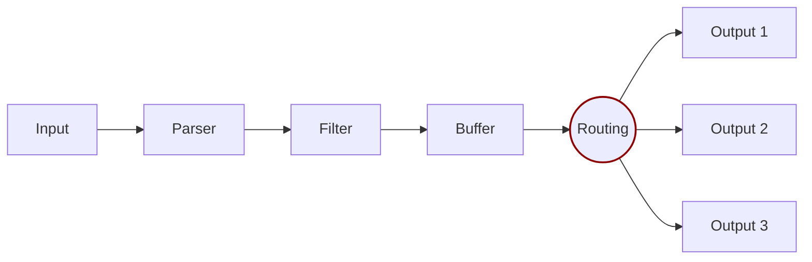

# Routing

Routing is a core feature that lets you route your data through filters and then to one or multiple destinations. Fluent Bit provides multiple routing mechanisms:

- **Tag-based routing**: The traditional approach that uses tags and matching rules to determine where data flows. This method routes entire chunks of data based on their assigned tags.
- **Conditional routing**: A newer approach that uses conditions to evaluate individual records and route them to different outputs based on their content. This method provides fine-grained, per-record routing decisions.
- **Label-based matching**: A mechanism used with direct routing that stores labels and plugin names in chunk metadata to enable stable routing even when output configuration changes. This ensures chunks continue routing to the correct outputs after restarts or configuration reordering.



## Tag-based routing

Tag-based routing is the traditional routing mechanism in Fluent Bit. It relies on two key concepts:

- **Tag**: A human-readable identifier assigned to data at the input stage
- **Match**: A pattern rule configured on outputs to select which tagged data to receive

When data is generated by an input plugin, it comes with a `Tag`. The tag is usually configured manually in the input configuration. To define where to route data, specify a `Match` rule in the output configuration.

### Basic tag matching

Consider the following configuration example that delivers CPU metrics to an Elasticsearch database and memory metrics to the standard output interface:




```yaml
pipeline:
  inputs:
    - name: cpu
      tag: my_cpu

    - name: mem
      tag: my_mem

  outputs:
    - name: es
      match: my_cpu

    - name: stdout
      match: my_mem
```




```text
[INPUT]
  Name cpu
  Tag  my_cpu

[INPUT]
  Name mem
  Tag  my_mem

[OUTPUT]
  Name   es
  Match  my_cpu

[OUTPUT]
  Name   stdout
  Match  my_mem
```




Routing reads the `Input` `Tag` and the `Output` `Match` rules. If data has a `Tag` that doesn't match at routing time, the data is deleted.

### Routing with wildcards

Routing is flexible enough to support wildcards in the `Match` pattern. The following example defines a common destination for both sources of data:




```yaml
pipeline:
  inputs:
    - name: cpu
      tag: my_cpu

    - name: mem
      tag: my_mem

  outputs:
    - name: stdout
      match: 'my_*'
```




```text
[INPUT]
  Name cpu
  Tag  my_cpu

[INPUT]
  Name mem
  Tag  my_mem

[OUTPUT]
  Name   stdout
  Match  my_*
```




The match rule is set to `my_*`, which matches any Tag starting with `my_`.

### Routing with regular expressions

Routing also provides support for regular expressions with the `Match_Regex` pattern, allowing for more complex and precise matching criteria. The following example demonstrates how to route data from sources based on a regular expression:




```yaml
pipeline:
  inputs:
    - name: temperature_sensor
      tag: temp_sensor_A

    - name: humidity_sensor
      tag: humid_sensor_B

  outputs:
    - name: stdout
      match_regex: '.*_sensor_[AB]'
```




```text
[INPUT]
  Name temperature_sensor
  Tag  temp_sensor_A

[INPUT]
  Name humidity_sensor
  Tag  humid_sensor_B

[OUTPUT]
  Name         stdout
  Match_regex  .*_sensor_[AB]
```




In this configuration, the `Match_regex` rule is set to `.*_sensor_[AB]`. This regular expression matches any `Tag` that ends with `_sensor_A` or `_sensor_B`, regardless of what precedes it. This approach provides a more flexible and powerful way to handle different source tags with a single routing rule.

## Conditional routing

Conditional routing lets you route individual records to different outputs based on the content of each record. Unlike tag-based routing, which operates on entire data chunks, conditional routing evaluates conditions against each record and routes them accordingly.


Conditional routing is available in Fluent Bit version 4.2 and greater. This feature requires YAML configuration files.


### How conditional routing works

Conditional routing uses a `routes` block within input configurations to define routing rules. Each route specifies:

- A unique name for the route
- A condition that determines which records match the route
- One or more output destinations for matching records

When a record arrives, Fluent Bit evaluates the conditions for each route in order. Records are sent to outputs whose conditions they match. You can also define a default route to catch records that don't match any other condition.

### Configuration syntax

The `routes` block uses the following syntax:




```yaml
pipeline:
  inputs:
    - name: input_plugin_name
      tag: input_tag
      routes:
        logs:
          - name: route_name
            condition:
              op: {and|or}
              rules:
                - field: {field_name}
                  op: {comparison_operator}
                  value: {comparison_value}
            to:
              outputs:
                - output_alias_or_name
          - name: default_route
            condition:
              default: true
            to:
              outputs:
                - fallback_output

  outputs:
    - name: output_plugin_name
      alias: output_alias
```




### Route configuration parameters

| Parameter | Description |
| --- | --- |
| `name` | A unique identifier for the route. |
| `condition` | The condition block that determines which records match this route. |
| `condition.op` | The logical operator for combining multiple rules. Valid values are `and` or `or`. |
| `condition.rules` | An array of rules to evaluate against each record. |
| `condition.default` | When set to `true`, this route matches all records that don't match other routes. |
| `to.outputs` | An array of output names or aliases to send matching records to. |
| `per_record_routing` | When set to `true`, enables per-record evaluation. Defaults to `false`. |

### Condition rules

Each rule in the `condition.rules` array must include:

| Parameter | Description |
| --- | --- |
| `field` | The field within your logs to evaluate. Uses [record accessor syntax](/administration/configuring-fluent-bit/classic-mode/record-accessor.md). |
| `op` | The comparison operator. |
| `value` | This is the value to compare against. It can be a single value or an array for `in` and `not_in` operators. |
| `context` | Optional. Specifies where to look for the field. See context types below. Defaults to `body`. |

### Context types

The `context` parameter determines where Fluent Bit looks for the field when evaluating a condition rule. This enables routing decisions based on different parts of a record's data structure:

| Context | Description |
| --- | --- |
| `body` | The main record body containing the log message and fields. This is the default context. |
| `metadata` | Record-level metadata associated with individual records. |
| `group_metadata` | Group-level metadata shared across records in the same group. |
| `group_attributes` | Group-level attributes shared across records in the same group. |
| `otel_resource_attributes` | OpenTelemetry resource attributes that identify the entity producing telemetry. |
| `otel_scope_attributes` | OpenTelemetry scope attributes that identify the instrumentation scope. |
| `otel_scope_metadata` | OpenTelemetry scope metadata containing scope name, version, and other scope information. |

### Comparison operators

The following comparison operators are available for condition rules:

| Operator | Description |
| --- | --- |
| `eq` | Equal to |
| `neq` | Not equal to |
| `gt` | Greater than |
| `lt` | Less than |
| `gte` | Greater than or equal to |
| `lte` | Less than or equal to |
| `regex` | Matches a regular expression |
| `not_regex` | Doesn't match a regular expression |
| `in` | Is included in the specified array |
| `not_in` | Isn't included in the specified array |

### Signal types

Conditional routing supports different signal types to route logs, metrics, and traces separately:

| Signal | Description |
| --- | --- |
| `logs` | Routes log records |
| `metrics` | Routes metric records |
| `traces` | Routes trace records |
| `any` | Routes all signal types |

## Conditional routing examples

### Route logs by severity level

This example routes logs to different outputs based on their severity level:




```yaml
pipeline:
  inputs:
    - name: tail
      path: /var/log/app/*.log
      tag: app.logs
      routes:
        logs:
          - name: error_logs
            condition:
              op: or
              rules:
                - field: "$level"
                  op: eq
                  value: "error"
                - field: "$level"
                  op: eq
                  value: "fatal"
            to:
              outputs:
                - error_destination

          - name: info_logs
            condition:
              op: and
              rules:
                - field: "$level"
                  op: eq
                  value: "info"
            to:
              outputs:
                - info_destination

          - name: default_logs
            condition:
              default: true
            to:
              outputs:
                - default_destination

  outputs:
    - name: elasticsearch
      alias: error_destination
      host: errors.example.com
      index: error-logs

    - name: elasticsearch
      alias: info_destination
      host: logs.example.com
      index: info-logs

    - name: stdout
      alias: default_destination
```




In this configuration:

- Records with `level` equal to `error` or `fatal` are sent to the `error_destination` output.
- Records with `level` equal to `info` are sent to the `info_destination` output.
- All other records are sent to the `default_destination` output.

### Route by service name

This example routes logs from different services to dedicated outputs:




```yaml
pipeline:
  inputs:
    - name: tail
      path: /var/log/services/*.log
      tag: services.logs
      routes:
        logs:
          - name: critical_services
            condition:
              op: and
              rules:
                - field: "$service"
                  op: in
                  value: ["payment", "authentication", "database"]
            to:
              outputs:
                - critical_output

          - name: standard_services
            condition:
              default: true
            to:
              outputs:
                - standard_output

  outputs:
    - name: splunk
      alias: critical_output
      host: splunk.example.com
      token: ${SPLUNK_TOKEN}

    - name: stdout
      alias: standard_output
```




### Route with multiple conditions

This example uses multiple conditions with the `and` operator:




```yaml
pipeline:
  inputs:
    - name: tail
      path: /var/log/app/*.log
      tag: app.logs
      routes:
        logs:
          - name: high_priority_errors
            condition:
              op: and
              rules:
                - field: "$level"
                  op: eq
                  value: "error"
                - field: "$environment"
                  op: eq
                  value: "production"
                - field: "$response_time"
                  op: gt
                  value: 5000
            to:
              outputs:
                - pagerduty_output
                - elasticsearch_output

          - name: all_logs
            condition:
              default: true
            to:
              outputs:
                - elasticsearch_output

  outputs:
    - name: http
      alias: pagerduty_output
      host: events.pagerduty.com
      uri: /v2/enqueue
      format: json

    - name: elasticsearch
      alias: elasticsearch_output
      host: logs.example.com
      index: application-logs
```




This configuration sends high-priority production errors with slow response times to both PagerDuty and Elasticsearch, while all other logs go only to Elasticsearch.

### Route using regular expressions

This example uses regular expression matching for flexible routing:




```yaml
pipeline:
  inputs:
    - name: tail
      path: /var/log/app/*.log
      tag: app.logs
      routes:
        logs:
          - name: security_events
            condition:
              op: or
              rules:
                - field: "$message"
                  op: regex
                  value: "(?i)(unauthorized|forbidden|authentication failed)"
                - field: "$event_type"
                  op: regex
                  value: "^security\\."
            to:
              outputs:
                - security_output

          - name: other_logs
            condition:
              default: true
            to:
              outputs:
                - general_output

  outputs:
    - name: splunk
      alias: security_output
      host: security-splunk.example.com

    - name: elasticsearch
      alias: general_output
      host: logs.example.com
```




### Route metrics by name or labels

This example routes metrics to different backends based on metric name patterns:




```yaml
pipeline:
  inputs:
    - name: node_exporter_metrics
      tag: node.metrics
      routes:
        metrics:
          - name: cpu_metrics
            condition:
              op: or
              rules:
                - field: "$metric.name"
                  op: regex
                  value: "^node_cpu_.*"
                - field: "$metric.name"
                  op: regex
                  value: "^process_cpu_.*"
            to:
              outputs:
                - cpu_metrics_output

          - name: memory_metrics
            condition:
              op: or
              rules:
                - field: "$metric.name"
                  op: regex
                  value: "^node_memory_.*"
                - field: "$metric.name"
                  op: regex
                  value: "^process_resident_memory_.*"
            to:
              outputs:
                - memory_metrics_output

          - name: all_metrics
            condition:
              default: true
            to:
              outputs:
                - general_metrics_output

  outputs:
    - name: prometheus_remote_write
      alias: cpu_metrics_output
      host: prometheus-cpu.example.com
      uri: /api/v1/write

    - name: prometheus_remote_write
      alias: memory_metrics_output
      host: prometheus-memory.example.com
      uri: /api/v1/write

    - name: prometheus_remote_write
      alias: general_metrics_output
      host: prometheus.example.com
      uri: /api/v1/write
```




This configuration routes CPU-related metrics to a dedicated Prometheus instance, memory metrics to another, and all other metrics to a general metrics backend.

### Route traces by service or attributes

This example routes traces to different backends based on service name and span attributes:




```yaml
pipeline:
  inputs:
    - name: opentelemetry
      listen: 0.0.0.0
      port: 4318
      tag: otel.traces
      routes:
        traces:
          - name: critical_service_traces
            condition:
              op: or
              rules:
                - field: "$resource['service.name']"
                  op: in
                  value: ["payment-service", "auth-service", "order-service"]
                  context: otel_resource_attributes
                - field: "$span.status_code"
                  op: eq
                  value: "ERROR"
            to:
              outputs:
                - critical_traces_output

          - name: high_latency_traces
            condition:
              op: and
              rules:
                - field: "$span.duration"
                  op: gt
                  value: 5000000000
            to:
              outputs:
                - latency_traces_output

          - name: default_traces
            condition:
              default: true
            to:
              outputs:
                - general_traces_output

  outputs:
    - name: opentelemetry
      alias: critical_traces_output
      host: jaeger-critical.example.com
      port: 4317

    - name: opentelemetry
      alias: latency_traces_output
      host: jaeger-latency.example.com
      port: 4317

    - name: opentelemetry
      alias: general_traces_output
      host: jaeger.example.com
      port: 4317
```




This configuration routes traces from critical services and error traces to a dedicated tracing backend, high-latency traces to a latency analysis backend, and all other traces to a general backend.

### Route multiple signal types

This example demonstrates routing logs, metrics, and traces with a single input configuration:




```yaml
pipeline:
  inputs:
    - name: opentelemetry
      listen: 0.0.0.0
      port: 4318
      tag: otel.data
      routes:
        logs:
          - name: error_logs
            condition:
              op: and
              rules:
                - field: "$severity_text"
                  op: in
                  value: ["ERROR", "FATAL", "CRITICAL"]
            to:
              outputs:
                - error_logs_output

          - name: all_logs
            condition:
              default: true
            to:
              outputs:
                - general_logs_output

        metrics:
          - name: application_metrics
            condition:
              op: and
              rules:
                - field: "$resource['service.namespace']"
                  op: eq
                  value: "production"
                  context: otel_resource_attributes
            to:
              outputs:
                - prod_metrics_output

          - name: all_metrics
            condition:
              default: true
            to:
              outputs:
                - general_metrics_output

        traces:
          - name: sampled_traces
            condition:
              op: and
              rules:
                - field: "$resource['environment']"
                  op: eq
                  value: "production"
                  context: otel_resource_attributes
            to:
              outputs:
                - prod_traces_output

          - name: all_traces
            condition:
              default: true
            to:
              outputs:
                - general_traces_output

  outputs:
    - name: loki
      alias: error_logs_output
      host: loki-errors.example.com

    - name: loki
      alias: general_logs_output
      host: loki.example.com

    - name: prometheus_remote_write
      alias: prod_metrics_output
      host: prometheus-prod.example.com
      uri: /api/v1/write

    - name: prometheus_remote_write
      alias: general_metrics_output
      host: prometheus.example.com
      uri: /api/v1/write

    - name: opentelemetry
      alias: prod_traces_output
      host: jaeger-prod.example.com
      port: 4317

    - name: opentelemetry
      alias: general_traces_output
      host: jaeger.example.com
      port: 4317
```




This configuration shows how to define separate routing rules for each signal type within the same input, enabling unified observability data collection with differentiated routing.

## Label-based matching

Label-based matching is a feature that enhances direct routing by storing labels and plugin names in chunk metadata. This enables stable routing that survives configuration changes, restarts, and output reordering.


Label-based matching is automatically used when direct routing is enabled. This feature is available in Fluent Bit version 4.2 and greater.


### How label-based matching works

When chunks are created with direct routes (routes defined directly in input configurations), Fluent Bit stores routing information in chunk metadata. This metadata includes:

- **Labels**: Textual identifiers used to match output instances. Labels come in two forms:
  - **Aliases**: User-provided identifiers set by the `alias` configuration property
  - **Generated names**: Automatically created when no alias is provided, following the pattern `{plugin_name}.{sequence_number}` (for example, `stdout.0`, `stdout.1`, or `http.0`)
- **Plugin names**: The plugin type name (for example, `stdout`, `http`, or `elasticsearch`) to enable type-safe matching

When Fluent Bit restarts or loads chunks from storage, it restores routes by matching stored labels against current output configurations. The matching process follows this order:

1. First attempts to match stored labels against current output aliases
2. Then attempts to match against current generated names
3. Falls back to numeric ID matching if no label was stored

Plugin name matching ensures that chunks only route to outputs of the same plugin type, preventing routing to outputs of different types that might share the same alias or name.

### Benefits of label-based matching

Label-based matching provides several advantages:

- **Configuration resilience**: Chunks continue routing to the correct outputs even when output IDs change due to configuration reordering
- **Stable routing after restarts**: When Fluent Bit restarts and loads chunks from storage, it can restore routes using labels instead of relying solely on numeric IDs
- **Type safety**: Plugin name matching prevents routing to outputs of different plugin types
- **Backward compatibility**: Chunks without labels fall back to numeric ID matching, maintaining compatibility with older Fluent Bit versions

### Configuration

Label-based matching works automatically with direct routing. To use it effectively, assign aliases to your outputs:




```yaml
pipeline:
  inputs:
    - name: tail
      path: /var/log/app/*.log
      tag: app.logs
      routes:
        logs:
          - name: error_logs
            condition:
              op: and
              rules:
                - field: "$level"
                  op: eq
                  value: "error"
            to:
              outputs:
                - error_destination

  outputs:
    - name: elasticsearch
      alias: error_destination
      host: errors.example.com
      index: error-logs
```




```text
[INPUT]
  Name tail
  Path /var/log/app/*.log
  Tag  app.logs

[OUTPUT]
  Name  elasticsearch
  Alias error_destination
  Host  errors.example.com
  Index error-logs
  Match app.logs
```




In this example, the output has an alias `error_destination`. When chunks are created with direct routes to this output, Fluent Bit stores the alias `error_destination` in chunk metadata. If the configuration is later reordered or Fluent Bit restarts, the chunks can still be routed to the correct output by matching the stored alias.

### Label matching behavior

When restoring routes from chunk metadata, Fluent Bit uses the following matching logic:

1. **Alias matching**: If a stored label matches an output's alias, that output is selected (assuming plugin names also match)
2. **Generated name matching**: If no alias match is found, Fluent Bit attempts to match the stored label against generated names
3. **ID fallback**: If no label match is found, Fluent Bit falls back to matching by numeric output ID

This multi-step matching process ensures that routing remains stable even when:
- Outputs are reordered in the configuration
- New outputs are added before existing ones
- Output IDs are reassigned

### Plugin name matching

Plugin name matching provides type safety by ensuring that chunks only route to outputs of the same plugin type. For example, if a chunk was originally routed to an Elasticsearch output, it won't accidentally route to an HTTP output that happens to have the same alias.

Plugin names are stored alongside labels in chunk metadata and are checked during route restoration to ensure type compatibility.

### Example: Routing with aliases

This example demonstrates how label-based matching works with output aliases:




```yaml
pipeline:
  inputs:
    - name: tail
      path: /var/log/app/*.log
      tag: app.logs
      routes:
        logs:
          - name: production_logs
            condition:
              op: and
              rules:
                - field: "$environment"
                  op: eq
                  value: "production"
            to:
              outputs:
                - prod_logs_output

          - name: development_logs
            condition:
              op: and
              rules:
                - field: "$environment"
                  op: eq
                  value: "development"
            to:
              outputs:
                - dev_logs_output

  outputs:
    - name: elasticsearch
      alias: prod_logs_output
      host: prod-logs.example.com
      index: production-logs

    - name: elasticsearch
      alias: dev_logs_output
      host: dev-logs.example.com
      index: development-logs
```




In this configuration:

- Production logs are routed to the `prod_logs_output` output (aliased Elasticsearch instance)
- Development logs are routed to the `dev_logs_output` output (aliased Elasticsearch instance)
- When chunks are created, Fluent Bit stores the aliases (`prod_logs_output` and `dev_logs_output`) in chunk metadata
- If Fluent Bit restarts or the configuration is reordered, chunks can still be routed correctly by matching the stored aliases

### Best practices

To get the most benefit from label-based matching:

1. **Use aliases**: Assign meaningful aliases to your outputs to make routing more stable and easier to understand
2. **Keep aliases unique**: Ensure that aliases are unique within your configuration to avoid ambiguity
3. **Use descriptive names**: Choose aliases that clearly indicate the purpose of each output (for example, `error_logs_output`, `metrics_backend`, or `trace_collector`)
4. **Combine with direct routing**: Label-based matching works best when used with direct routing (conditional routing or direct input-output connections)

## Routing metrics

Fluent Bit provides comprehensive routing metrics to help you monitor routing performance and identify issues such as dropped records or unmatched logs. These metrics are available through the built-in HTTP server's `/metrics` endpoint.


Routing metrics are available in Fluent Bit version 4.2 and greater. To access these metrics, enable the [HTTP server](/administration/monitoring.md) in your configuration.


### Available metrics

The following routing metrics are exposed in Prometheus format:

| Metric | Type | Description | Labels |
| --- | --- | --- | --- |
| `fluentbit_routing_logs_records_total` | Counter | Total number of log records routed from input to output. | `input`, `output` |
| `fluentbit_routing_logs_bytes_total` | Counter | Total bytes routed from input to output for logs. | `input`, `output` |
| `fluentbit_routing_logs_drop_records_total` | Counter | Total number of log records dropped during routing. | `input`, `output` |
| `fluentbit_routing_logs_drop_bytes_total` | Counter | Total bytes dropped during routing for logs. | `input`, `output` |

### Metric labels

Each routing metric includes labels to help identify the source and destination:

- **input**: The name or alias of the input plugin that generated the data
- **output**: The name or alias of the output plugin that received the data, or `unmatched` for records that didn't match any route

### Accessing routing metrics

Routing metrics are automatically integrated into the `/metrics` endpoint when the HTTP server is enabled. To enable the HTTP server, add the following to your configuration:




```yaml
service:
  http_server: true
  http_listen: 0.0.0.0
  http_port: 2020
```




```text
[SERVICE]
  HTTP_Server  On
  HTTP_Listen  0.0.0.0
  HTTP_Port    2020
```




Once enabled, access routing metrics at `http://localhost:2020/api/v2/metrics` (or `/api/v1/metrics/prometheus` for Prometheus format). The metrics appear alongside other Fluent Bit internal metrics.

### Example metric output

When routing is active, you'll see metrics similar to:

```text
# HELP fluentbit_routing_logs_records_total Total log records routed from input to output
# TYPE fluentbit_routing_logs_records_total counter
fluentbit_routing_logs_records_total{input="tail.0",output="elasticsearch.0"} 1523
fluentbit_routing_logs_records_total{input="tail.0",output="stdout.0"} 847

# HELP fluentbit_routing_logs_drop_records_total Total log records dropped during routing
# TYPE fluentbit_routing_logs_drop_records_total counter
fluentbit_routing_logs_drop_records_total{input="tail.0",output="unmatched"} 12
```

### Use cases for routing metrics

Routing metrics enable several observability use cases:

- **Monitor routing health**: Track the volume of records flowing through each route to ensure data is reaching expected destinations
- **Detect unmatched records**: Identify records that don't match any routing rules by monitoring the `unmatched` output label
- **Track dropped data**: Monitor dropped records to detect potential data loss issues
- **Capacity planning**: Use bytes metrics to understand data volume flowing through different routes
- **Troubleshooting**: Compare records routed versus dropped to diagnose routing configuration issues

## Choosing a routing approach

Use the following guidelines to choose between tag-based routing, conditional routing, and label-based matching:

| Use case | Recommended approach |
| --- | --- |
| Route all data from an input to specific outputs | Tag-based routing |
| Route data based on source or input type | Tag-based routing |
| Route individual records based on content | Conditional routing |
| Split logs by severity or other field values | Conditional routing |
| Apply different processing to subsets of data | Conditional routing |
| Routing without content inspection | Tag-based routing |
| Stable routing that survives configuration changes | Label-based matching (with direct routing) |
| Routing after restarts with storage backlog | Label-based matching (with direct routing) |

You can combine multiple approaches in a single configuration. Use tag-based routing for broad categorization, conditional routing for fine-grained decisions, and label-based matching to ensure stable routing when using direct routing with storage backlogs.
