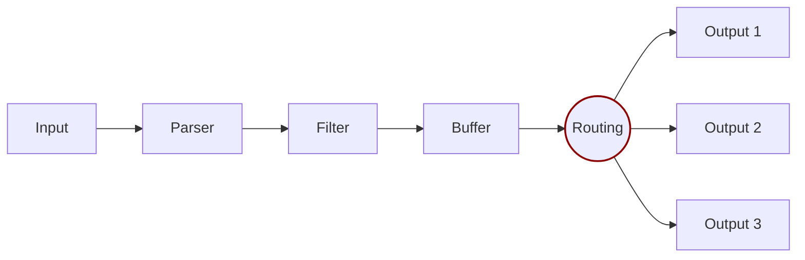

# Routing

Routing is a core feature that lets you route your data through filters and then to one or multiple destinations. Fluent Bit provides two routing mechanisms:

- **Tag-based routing**: The traditional approach that uses tags and matching rules to determine where data flows. This method routes entire chunks of data based on their assigned tags.
- **Conditional routing**: A newer approach that uses conditions to evaluate individual records and route them to different outputs based on their content. This method provides fine-grained, per-record routing decisions.



## Tag-based routing

Tag-based routing is the traditional routing mechanism in Fluent Bit. It relies on two key concepts:

- **Tag**: A human-readable identifier assigned to data at the input stage
- **Match**: A pattern rule configured on outputs to select which tagged data to receive

When data is generated by an input plugin, it comes with a `Tag`. The tag is usually configured manually in the input configuration. To define where to route data, specify a `Match` rule in the output configuration.

### Basic tag matching

Consider the following configuration example that delivers CPU metrics to an Elasticsearch database and memory metrics to the standard output interface:




```yaml
pipeline:
  inputs:
    - name: cpu
      tag: my_cpu

    - name: mem
      tag: my_mem

  outputs:
    - name: es
      match: my_cpu

    - name: stdout
      match: my_mem
```




```text
[INPUT]
  Name cpu
  Tag  my_cpu

[INPUT]
  Name mem
  Tag  my_mem

[OUTPUT]
  Name   es
  Match  my_cpu

[OUTPUT]
  Name   stdout
  Match  my_mem
```




Routing reads the `Input` `Tag` and the `Output` `Match` rules. If data has a `Tag` that doesn't match at routing time, the data is deleted.

### Routing with wildcards

Routing is flexible enough to support wildcards in the `Match` pattern. The following example defines a common destination for both sources of data:




```yaml
pipeline:
  inputs:
    - name: cpu
      tag: my_cpu

    - name: mem
      tag: my_mem

  outputs:
    - name: stdout
      match: 'my_*'
```




```text
[INPUT]
  Name cpu
  Tag  my_cpu

[INPUT]
  Name mem
  Tag  my_mem

[OUTPUT]
  Name   stdout
  Match  my_*
```




The match rule is set to `my_*`, which matches any Tag starting with `my_`.

### Routing with regular expressions

Routing also provides support for regular expressions with the `Match_Regex` pattern, allowing for more complex and precise matching criteria. The following example demonstrates how to route data from sources based on a regular expression:




```yaml
pipeline:
  inputs:
    - name: temperature_sensor
      tag: temp_sensor_A

    - name: humidity_sensor
      tag: humid_sensor_B

  outputs:
    - name: stdout
      match_regex: '.*_sensor_[AB]'
```




```text
[INPUT]
  Name temperature_sensor
  Tag  temp_sensor_A

[INPUT]
  Name humidity_sensor
  Tag  humid_sensor_B

[OUTPUT]
  Name         stdout
  Match_regex  .*_sensor_[AB]
```




In this configuration, the `Match_regex` rule is set to `.*_sensor_[AB]`. This regular expression matches any `Tag` that ends with `_sensor_A` or `_sensor_B`, regardless of what precedes it. This approach provides a more flexible and powerful way to handle different source tags with a single routing rule.

## Conditional routing

Conditional routing lets you route individual records to different outputs based on the content of each record. Unlike tag-based routing, which operates on entire data chunks, conditional routing evaluates conditions against each record and routes them accordingly.


Conditional routing is available in Fluent Bit version 4.0 and greater. This feature requires YAML configuration files.


### How conditional routing works

Conditional routing uses a `routes` block within input configurations to define routing rules. Each route specifies:

- A unique name for the route
- A condition that determines which records match the route
- One or more output destinations for matching records

When a record arrives, Fluent Bit evaluates the conditions for each route in order. Records are sent to outputs whose conditions they match. You can also define a default route to catch records that don't match any other condition.

### Configuration syntax

The `routes` block uses the following syntax:




```yaml
pipeline:
  inputs:
    - name: input_plugin_name
      tag: input_tag
      routes:
        logs:
          - name: route_name
            condition:
              op: {and|or}
              rules:
                - field: {field_name}
                  op: {comparison_operator}
                  value: {comparison_value}
            to:
              outputs:
                - output_alias_or_name
          - name: default_route
            condition:
              default: true
            to:
              outputs:
                - fallback_output

  outputs:
    - name: output_plugin_name
      alias: output_alias
```




### Route configuration parameters

| Parameter | Description |
| --- | --- |
| `name` | A unique identifier for the route. |
| `condition` | The condition block that determines which records match this route. |
| `condition.op` | The logical operator for combining multiple rules. Valid values are `and` or `or`. |
| `condition.rules` | An array of rules to evaluate against each record. |
| `condition.default` | When set to `true`, this route matches all records that don't match other routes. |
| `to.outputs` | An array of output names or aliases to send matching records to. |
| `per_record_routing` | When set to `true`, enables per-record evaluation. Defaults to `false`. |

### Condition rules

Each rule in the `condition.rules` array must include:

| Parameter | Description |
| --- | --- |
| `field` | The field within your logs to evaluate. Uses [record accessor syntax](/administration/configuring-fluent-bit/classic-mode/record-accessor.md). |
| `op` | The comparison operator. |
| `value` | The value to compare against. Can be a single value or an array for `in` and `not_in` operators. |
| `context` | Optional. Specifies where to look for the field. Valid values are `body`, `metadata`, `otel_resource_attributes`, `otel_scope_attributes`. Defaults to `body`. |

### Comparison operators

The following comparison operators are available for condition rules:

| Operator | Description |
| --- | --- |
| `eq` | Equal to |
| `neq` | Not equal to |
| `gt` | Greater than |
| `lt` | Less than |
| `gte` | Greater than or equal to |
| `lte` | Less than or equal to |
| `regex` | Matches a regular expression |
| `not_regex` | Doesn't match a regular expression |
| `in` | Is included in the specified array |
| `not_in` | Isn't included in the specified array |

### Signal types

Conditional routing supports different signal types to route logs, metrics, and traces separately:

| Signal | Description |
| --- | --- |
| `logs` | Routes log records |
| `metrics` | Routes metric records |
| `traces` | Routes trace records |
| `any` | Routes all signal types |

## Conditional routing examples

### Route logs by severity level

This example routes logs to different outputs based on their severity level:




```yaml
pipeline:
  inputs:
    - name: tail
      path: /var/log/app/*.log
      tag: app.logs
      routes:
        logs:
          - name: error_logs
            condition:
              op: or
              rules:
                - field: "$level"
                  op: eq
                  value: "error"
                - field: "$level"
                  op: eq
                  value: "fatal"
            to:
              outputs:
                - error_destination

          - name: info_logs
            condition:
              op: and
              rules:
                - field: "$level"
                  op: eq
                  value: "info"
            to:
              outputs:
                - info_destination

          - name: default_logs
            condition:
              default: true
            to:
              outputs:
                - default_destination

  outputs:
    - name: elasticsearch
      alias: error_destination
      host: errors.example.com
      index: error-logs

    - name: elasticsearch
      alias: info_destination
      host: logs.example.com
      index: info-logs

    - name: stdout
      alias: default_destination
```




In this configuration:

- Records with `level` equal to `error` or `fatal` are sent to the `error_destination` output.
- Records with `level` equal to `info` are sent to the `info_destination` output.
- All other records are sent to the `default_destination` output.

### Route by service name

This example routes logs from different services to dedicated outputs:




```yaml
pipeline:
  inputs:
    - name: tail
      path: /var/log/services/*.log
      tag: services.logs
      routes:
        logs:
          - name: critical_services
            condition:
              op: and
              rules:
                - field: "$service"
                  op: in
                  value: ["payment", "authentication", "database"]
            to:
              outputs:
                - critical_output

          - name: standard_services
            condition:
              default: true
            to:
              outputs:
                - standard_output

  outputs:
    - name: splunk
      alias: critical_output
      host: splunk.example.com
      token: ${SPLUNK_TOKEN}

    - name: stdout
      alias: standard_output
```




### Route with multiple conditions

This example uses multiple conditions with the `and` operator:




```yaml
pipeline:
  inputs:
    - name: tail
      path: /var/log/app/*.log
      tag: app.logs
      routes:
        logs:
          - name: high_priority_errors
            condition:
              op: and
              rules:
                - field: "$level"
                  op: eq
                  value: "error"
                - field: "$environment"
                  op: eq
                  value: "production"
                - field: "$response_time"
                  op: gt
                  value: 5000
            to:
              outputs:
                - pagerduty_output
                - elasticsearch_output

          - name: all_logs
            condition:
              default: true
            to:
              outputs:
                - elasticsearch_output

  outputs:
    - name: http
      alias: pagerduty_output
      host: events.pagerduty.com
      uri: /v2/enqueue
      format: json

    - name: elasticsearch
      alias: elasticsearch_output
      host: logs.example.com
      index: application-logs
```




This configuration sends high-priority production errors with slow response times to both PagerDuty and Elasticsearch, while all other logs go only to Elasticsearch.

### Route using regular expressions

This example uses regular expression matching for flexible routing:




```yaml
pipeline:
  inputs:
    - name: tail
      path: /var/log/app/*.log
      tag: app.logs
      routes:
        logs:
          - name: security_events
            condition:
              op: or
              rules:
                - field: "$message"
                  op: regex
                  value: "(?i)(unauthorized|forbidden|authentication failed)"
                - field: "$event_type"
                  op: regex
                  value: "^security\\."
            to:
              outputs:
                - security_output

          - name: other_logs
            condition:
              default: true
            to:
              outputs:
                - general_output

  outputs:
    - name: splunk
      alias: security_output
      host: security-splunk.example.com

    - name: elasticsearch
      alias: general_output
      host: logs.example.com
```




## Choosing a routing approach

Use the following guidelines to choose between tag-based and conditional routing:

| Use case | Recommended approach |
| --- | --- |
| Route all data from an input to specific outputs | Tag-based routing |
| Route data based on source or input type | Tag-based routing |
| Route individual records based on content | Conditional routing |
| Split logs by severity or other field values | Conditional routing |
| Apply different processing to subsets of data | Conditional routing |
| Simple routing without content inspection | Tag-based routing |

You can combine both approaches in a single configuration. Use tag-based routing for broad categorization and conditional routing for fine-grained decisions within those categories.
