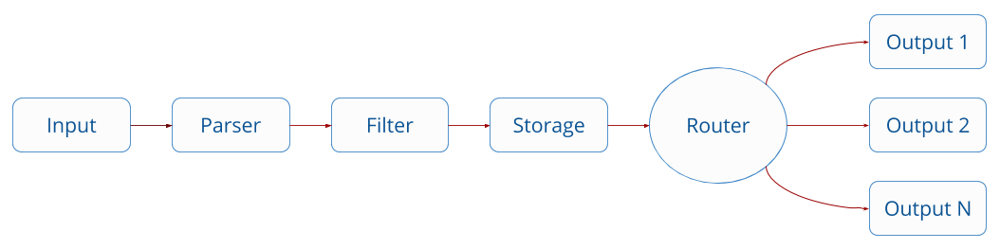
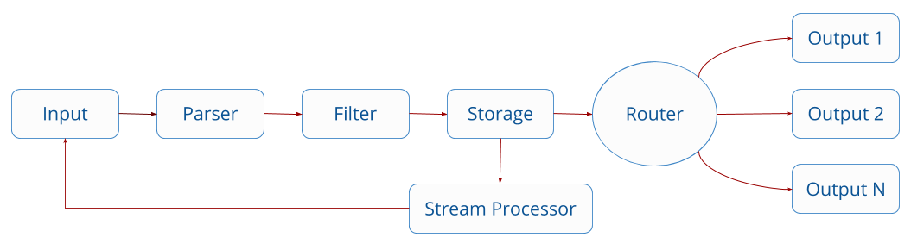

# Overview

Stream processing is a feature that lets you query continuous data streams while they're still in motion. Fluent Bit uses a streaming SQL engine for this process.

To understand how stream processing works in Fluent Bit, follow this overview of Fluent Bit architecture and how data travels through the pipeline.

## Fluent Bit data pipeline

[Fluent Bit](https://fluentbit.io) collects and process logs (also known as _records_) from different input sources, then parses and filters these records before they're stored. After data is processed and in a safe state, meaning either in memory or in the file system, the records are routed through the proper output destinations.

Most of the phases in the pipeline are implemented through plugins: input, filter, and output.

Filters can perform specific record modifications like appending or removing a key, enriching with metadata (for example, Kubernetes filter), or discarding records based on specific conditions. After data is stored, no further modifications are made, but records can optionally be redirected to the stream processor.

## Stream processor

The stream processor is an independent subsystem that checks for new records hitting the storage interface. Based on your configuration settings, the stream processor will attach to records that come from a specific input plugin or by applying tag and matching rules.

Every input instance is considered a stream. These streams collect data and ingest records into the pipeline.

By configuring specific SQL queries, you can perform specific tasks like key selections, filtering, and data aggregation. Keep in mind that there is no database; everything is schema-less and happens in memory. Concepts like tables that are common in relational database don't exist in Fluent Bit.

One powerful feature of the Fluent Bit stream processor is the ability to create new streams of data using the results from a previous SQL query. These results are re-ingested back into the pipeline to be consumed again for the stream processor, if desired, or routed to output destinations by any common record using tag/matching rules. (Stream processor results can be tagged.)
